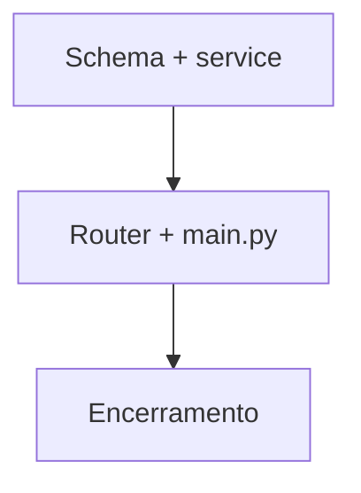

> **Para que serve:** Exemplo de plano multiagente — export CSV de itens (fictício).
> **Função:** Demonstrar fases, todos e encerramento no Claude Code (`/plano`).

# Example Item Export

## Contexto

| Item | Detalhe |
|------|---------|
| Branch | `feature/item-export` |
| Objetivo | Exportar catálogo em CSV para integradores |
| Referência | `src/routers/items.py` |
| Arquivos críticos | `src/main.py` — apenas F2 |
| Validação final | `pytest tests/ -x` |

## Diagrama de dependências

## Fase F1 — Schema e serviço

**Modelo:** haiku  
**Arquivos:** `src/services/export_service.py` (criar)  
**Mudanças:** Gerar CSV em memória a partir de lista paginada de itens.  
**Checklist:** Sem PII extra além do necessário; stream se lista grande.

## Fase F2 — Endpoint

**Modelo:** sonnet  
**Arquivos:** `src/routers/items.py`, `src/main.py`  
**Mudanças:** `GET /items/export` com auth JWT; registrar router se novo.  
**Checklist:** `Depends(get_current_user)`; content-type `text/csv`.

## Fase F3 — Encerramento

**Modelo:** sonnet  
**Checklist:** `pytest tests/ -x` retorna 0; todos `todo.status` = completed.
