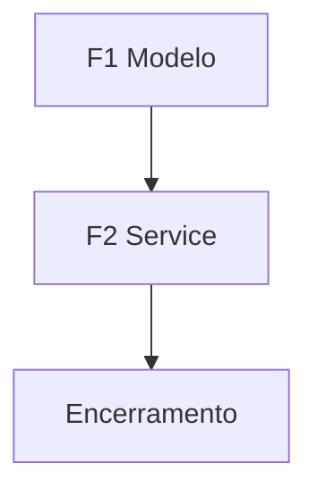

> **Para que serve:** Exemplo de plano — CRUD de webhook (fictício).
> **Função:** Demonstrar contexto, fases e encerramento para `/multiagent` no Claude Code.

# Webhook Config (exemplo)

## Contexto

| Item | Detalhe |
|------|---------|
| Branch | `feature/example-webhooks` |
| Objetivo | Template de plano para `/multiagent` |
| Arquivos críticos | `src/main.py` |
| Validação | `pytest tests/ -x` |

## Diagrama de dependências

## Fase F1 — Modelo

**Modelo:** haiku  
**Arquivos:** `src/models/webhook.py`, `src/schemas/webhook.py` (criar quando implementar)  
**Mudanças:** entidade com `url`, `events`, `secret`; response sem `secret`

## Fase F2 — Service

**Modelo:** sonnet  
**Mudanças:** dispatch HMAC + retry; fire-and-forget

## Encerramento

- [ ] Validação retorna 0
- [ ] Todos `todo.status` = completed
