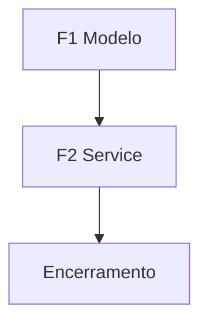

> **Para que serve:** Exemplo de plano multiagente gerado para CRUD de Item (fictício).
> **Função:** Demonstrar frontmatter, fases F1..FN, diagrama e critérios de encerramento no Cursor.

# Exemplo — Item CRUD (template)

## Contexto

| Item | Detalhe |
|------|---------|
| Branch | `feature/example-item` |
| Objetivo | Demonstrar estrutura de plano para comparação Cursor/Claude |
| Referência | `src/models/` (criar quando implementar de verdade) |
| Arquivos críticos | `src/main.py` |
| Validação final | `pytest tests/ -x` (placeholder) |

## Diagrama de dependências

## Convenções de execução

- Código em inglês; comunicação PT-BR
- Paralelo: não aplicável (2 fases sequenciais)
- Validação apenas no Encerramento

## Modelos por fase

| Fase | Tier |
|------|------|
| F1 | econômico |
| F2 | médio |
| F3 | econômico |

---

## Fase F1 — Modelo e schemas

**Objetivo:** Definir entidade Item e contratos create/response.

**Arquivos:**
- `src/models/item.py` (criar — quando houver código real)
- `src/schemas/item.py` (criar)

**Mudanças:**
- Campos: `id`, `name`, `is_active`, timestamps
- Response sem campos internos

**Checklist:**
- [ ] Schema de criação valida `name` não vazio

---

## Fase F2 — Service

**Objetivo:** Operações list/create com validação.

**Arquivos:**
- `src/services/item_service.py` (criar)

**Mudanças:**
- `list_items`, `create_item` com erros de domínio claros

**Checklist:**
- [ ] Testes cobrem happy path e 422

---

## Encerramento

**Critérios "verde":**
- [ ] Comando de validação do projeto retorna 0
- [ ] Todos `todo.status` = completed
