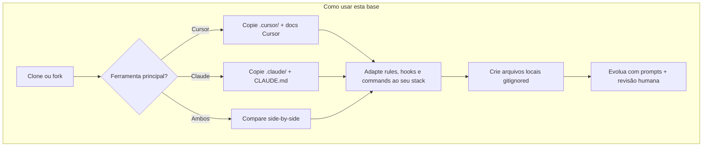
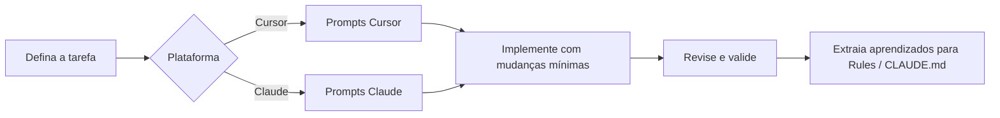

<div align="center">

# ⚡ Vibe Coding

**Base de comparação e templates de governança para desenvolvimento assistido por IA**

[](https://cursor.com)
[](https://claude.ai)
[](https://github.com/lns-l/Vibe-Coding)

*Dois scaffolds completos (`.cursor/` e `.claude/`), prompts, guias e constituição de projeto — prontos para copiar, comparar e adaptar no seu stack real.*

[Entregáveis principais](#-entregáveis-principais) · [Início rápido](#-início-rápido) · [Documentação](#-documentação) · [Estrutura](#-estrutura-do-repositório)

</div>

---

> **Para que serve:** Ponto de entrada do repositório Vibe-Coding — visão geral, links e mapa de toda a documentação e dos scaffolds.
> **Função:** Orientar humanos e agentes sobre como usar esta base como referência/comparação entre Cursor e Claude Code.

---

## 🎯 Sobre o projeto

**Vibe Coding** é uma **base template e de comparação** para governança de IA em projetos reais. Não é apenas uma coleção de prompts: inclui **dois scaffolds versionados** (Cursor e Claude Code), documentação longa, exemplos fictícios da **Acme API** (Python/FastAPI + React) e blocos *Para que serve* / *Função* em dezenas de arquivos para onboarding rápido.

| Pilar | O que entrega |
|-------|----------------|
| **`.cursor/`** | Rules MDC, hooks Python, slash commands, agents, skills, plans, MCP, notepads — [catálogo completo](.cursor/README.md) |
| **`.claude/`** | Settings, hooks bash, commands, subagents, plans, memória de exemplo — [catálogo completo](.claude/README.md) |
| **`CLAUDE.md` + raiz** | Constituição do projeto, env de exemplo, `.gitignore` — sem secrets reais no git |
| **`docs/`** | Prompts práticos + guias de arquitetura (estrutura detalhada de cada scaffold) |

> A estrutura de IA **não substitui** revisão humana — ela **amplifica** a qualidade dela. Use este repositório para **comparar abordagens** (rules vs CLAUDE.md, hooks Python vs bash, skills vs memory) antes de adotar no seu time.

---

## 📦 Entregáveis principais

### Scaffold Cursor — [`.cursor/`](.cursor/)

| Área | Conteúdo (resumo) |
|------|-------------------|
| **Rules** | Comportamento global, economia de tokens, Git, Docker, planos multiagente, padrões API/testes (exemplo Acme) |
| **Hooks** | Conventional Commits, linter pré-commit, tarefa leve no início da sessão |
| **Commands** | `/review`, `/pr`, `/plano-otimizado`, `/multiagent`, `/security-check`, `/infra-up` |
| **Agents & skills** | Nova feature, auditoria de segurança, setup de ambiente; skills `create-feature` e `security-audit` |
| **Plans & notepads** | Plano CRUD de exemplo; notepads de sprint e contrato API |

Guia longo: [docs/CURSOR_STRUCTURE_GUIDE.md](docs/CURSOR_STRUCTURE_GUIDE.md) · Políticas: [MODEL_SELECTION_GUIDE.md](.cursor/MODEL_SELECTION_GUIDE.md), [PARALLEL_AGENTS.md](.cursor/PARALLEL_AGENTS.md)

### Scaffold Claude Code — [`.claude/`](.claude/)

| Área | Conteúdo (resumo) |
|------|-------------------|
| **Settings & hooks** | Permissões versionadas; pré-bash, pós-edição e início de sessão |
| **Commands** | `/review`, `/pr`, `/plano`, `/multiagent`, `/security-check`, `/api.health-check`, `/deploy.staging` |
| **Subagents** | Nova feature e auditoria de segurança |
| **Plans & memory** | Planos fictícios (export CSV, webhooks); templates e exemplos de `MEMORY.md` |

Guia longo: [docs/CLAUDE_CODE_GUIDE.md](docs/CLAUDE_CODE_GUIDE.md) · Constituição na raiz: [CLAUDE.md](CLAUDE.md)

### Comparação rápida

| Conceito | Cursor | Claude Code |
|----------|--------|-------------|
| Regras persistentes | `.cursor/rules/*.mdc` | `CLAUDE.md` + rules locais |
| Automação | `hooks.json` + Python | `settings.json` + bash |
| Fluxos repetíveis | `commands/*.md` | `commands/*.md` |
| Especialistas | `agents/*.md` | `agents/*.md` (subagents) |
| Procedimentos longos | `skills/*/SKILL.md` | `memory/` + templates |
| Planos multiagente | `.cursor/plans/*.plan.md` | `.claude/plans/*.plan.md` |
| Secrets locais | `mcp.env` (de `mcp.env.example`) | `settings.local.json`, `CLAUDE.local.md` |

---

## 🚀 Início rápido

Use este repositório como **referência** ou **ponto de partida** — não como app executável (não há `src/` nem código de produção aqui).



### Passos sugeridos

1. **Leia** [PROJECT_GUIDE.md](PROJECT_GUIDE.md) — visão humana, stack fictícia e segurança.
2. **Escolha um scaffold** (ou os dois) e abra o README interno:
   - Cursor → [.cursor/README.md](.cursor/README.md)
   - Claude → [.claude/README.md](.claude/README.md)
3. **Copie para o seu projeto** apenas o que fizer sentido (rules, hooks, commands, plans de exemplo).
4. **Configure localmente** (nunca commitar secrets):
   - Cursor: `cp .cursor/mcp.env.example .cursor/mcp.env` e preencha tokens se usar MCP.
   - Claude: `cp CLAUDE.local.md.example CLAUDE.local.md` e `.claude/settings.local.json.example` → `settings.local.json`.
   - App: variáveis em [.env.example](.env.example) → `.env` no seu fork.
5. **Execute o fluxo de trabalho** com os [prompts](#prompts-práticos) adequados ao estágio (planejar → implementar → revisar).
6. **Consulte os guias longos** quando for customizar hooks, permissões ou maturidade do setup.

### Fluxo diário (prompts)



→ Cursor: [prompts](docs/cursor-vibe-coding-prompts.md) · Claude: [prompts](docs/claude-vibe-coding-prompts.md)

1. **Escolha o prompt** adequado ao estágio da tarefa.
2. **Preencha o contexto**: objetivo, stack, restrições e critérios de aceite.
3. **Peça mudanças cirúrgicas** — escopo claro evita refatorações desnecessárias.
4. **Valide** com testes e revisão humana antes de merge.
5. **Evolua a estrutura** — padrões recorrentes viram rules, skills ou trechos do `CLAUDE.md`.

### Exemplo rápido (Cursor)

Ver o [prompt base de planejamento](docs/cursor-vibe-coding-prompts.md#prompt-base-planejamento) completo:

```text
Atue como meu par-programador.

Contexto do projeto:
- [objetivo, stack e restrições]

Tarefa:
- [funcionalidade desejada]

Requisitos:
- Proponha um plano em passos curtos.
- Liste riscos e edge cases.
- Sugira testes antes de implementar.
- Implemente com mudanças mínimas e objetivas.
```

---

## 📚 Documentação

### Prompts práticos

#### Cursor — [Prompting para Cursor](docs/cursor-vibe-coding-prompts.md)

| Estágio | Prompt |
|---------|--------|
| Planejamento | [Prompt base](docs/cursor-vibe-coding-prompts.md#prompt-base-planejamento) |
| Implementação | [Prompt para implementação](docs/cursor-vibe-coding-prompts.md#prompt-para-implementação) |
| Revisão | [Prompt para revisão](docs/cursor-vibe-coding-prompts.md#prompt-para-revisão) |

#### Claude — [Prompting para Claude](docs/claude-vibe-coding-prompts.md)

| Estágio | Prompt |
|---------|--------|
| Descoberta | [Prompt base (descoberta e análise)](docs/claude-vibe-coding-prompts.md#prompt-base-descoberta-e-análise) |
| Codificação | [Prompt para codar com segurança](docs/claude-vibe-coding-prompts.md#prompt-para-codar-com-segurança) |
| Fechamento | [Prompt para fechamento](docs/claude-vibe-coding-prompts.md#prompt-para-fechamento) |

### Guias de arquitetura

| Documento | Escopo | Conteúdo |
|-----------|--------|----------|
| [CURSOR_STRUCTURE_GUIDE.md](docs/CURSOR_STRUCTURE_GUIDE.md) | `.cursor/` | Rules MDC, hooks, skills, MCP, agents, plans e checklist de maturidade |
| [CLAUDE_CODE_GUIDE.md](docs/CLAUDE_CODE_GUIDE.md) | `.claude/` | CLAUDE.md, settings, permissões, hooks, memória, subagents e roteiro de implantação |
| [BEST_PRACTICES_FROM_PRODUCTION.md](docs/BEST_PRACTICES_FROM_PRODUCTION.md) | Stack real | Boas práticas de produção (segurança, API, Docker, testes) como instruções reutilizáveis |

### Mapa da documentação

| Arquivo | Para que serve |
|---------|----------------|
| [README.md](README.md) | Entrada do repositório, comparação Cursor vs Claude e índice geral |
| [PROJECT_GUIDE.md](PROJECT_GUIDE.md) | Visão humana: stack de exemplo, segurança, links de config |
| [CLAUDE.md](CLAUDE.md) | Constituição do projeto para Claude Code (Acme API fictícia) |
| [CLAUDE.local.md.example](CLAUDE.local.md.example) | Modelo de overrides locais (gitignored) |
| [.env.example](.env.example) | Variáveis de app e integrações (sem secrets reais) |
| [.gitignore](.gitignore) | Exclusões: `.env`, `mcp.env`, settings locais, etc. |
| [docs/cursor-vibe-coding-prompts.md](docs/cursor-vibe-coding-prompts.md) | Prompts Cursor: planejar, implementar, revisar |
| [docs/claude-vibe-coding-prompts.md](docs/claude-vibe-coding-prompts.md) | Prompts Claude: descoberta, codar, fechar |
| [docs/CURSOR_STRUCTURE_GUIDE.md](docs/CURSOR_STRUCTURE_GUIDE.md) | Guia longo da pasta `.cursor/` |
| [docs/CLAUDE_CODE_GUIDE.md](docs/CLAUDE_CODE_GUIDE.md) | Guia longo da pasta `.claude/` |
| [docs/BEST_PRACTICES_FROM_PRODUCTION.md](docs/BEST_PRACTICES_FROM_PRODUCTION.md) | Práticas de produção importadas como instruções (não código) |
| [.cursor/README.md](.cursor/README.md) | **Catálogo detalhado** de todos os artefatos Cursor |
| [.claude/README.md](.claude/README.md) | **Catálogo detalhado** de todos os artefatos Claude |

> Arquivos individuais em `.cursor/` e `.claude/` incluem blocos *Para que serve* / *Função* no topo. Para listagem arquivo a arquivo, use os READMEs internos — não duplicamos os ~70 itens aqui.

---

## 📁 Estrutura do repositório

```
Vibe-Coding/
├── README.md                      # Este arquivo — entrada e comparação
├── PROJECT_GUIDE.md               # Índice humano e onboarding
├── CLAUDE.md                      # Constituição Claude Code (template Acme API)
├── CLAUDE.local.md.example        # Overrides locais (modelo, gitignored)
├── .env.example                   # Variáveis de app (template)
├── .gitignore
├── docs/
│   ├── cursor-vibe-coding-prompts.md
│   ├── claude-vibe-coding-prompts.md
│   ├── CURSOR_STRUCTURE_GUIDE.md
│   ├── CLAUDE_CODE_GUIDE.md
│   └── BEST_PRACTICES_FROM_PRODUCTION.md
├── .cursor/                       # Scaffold Cursor — ver .cursor/README.md
│   ├── README.md
│   ├── MODEL_SELECTION_GUIDE.md
│   ├── PARALLEL_AGENTS.md
│   ├── hooks.json · mcp.json · mcp.env.example · .cursorignore
│   ├── rules/                     # core, global, tool, example-stack, testing
│   ├── hooks/                     # check-commit-msg, check-linter, update-graph-on-session
│   ├── commands/                  # review, pr, plano-otimizado, multiagent, security-check, infra/
│   ├── agents/                    # new-feature, security-audit, setup-environment
│   ├── skills/                    # create-feature, security-audit
│   ├── plans/                     # exemplo + archive/
│   └── notepads/                  # sprint e contrato API (exemplos)
└── .claude/                       # Scaffold Claude — ver .claude/README.md
    ├── README.md
    ├── settings.json · settings.local.json.example
    ├── hooks/                     # pre-tool-bash, post-tool-edit, session-start
    ├── commands/                  # review, pr, plano, multiagent, security-check, api/, deploy/
    ├── agents/                    # new-feature, security-audit
    ├── plans/                     # exemplos + archive/
    ├── memory/                    # README + examples/
    └── memory-templates/          # MEMORY.md, feedback-commits
```

---

## 🧭 Para quem é este repositório

- **Devs** que querem prompts consistentes e scaffolds prontos para copiar
- **Times** comparando governança Cursor vs Claude Code antes de padronizar
- **Tech leads** montando rules, hooks, commands e planos multiagente do zero
- **Contribuidores** deste template — mantendo exemplos agnósticos e sem secrets

---

## 🤝 Contribuindo

Sugestões e melhorias são bem-vindas via issues e pull requests no [repositório](https://github.com/lns-l/Vibe-Coding).

Ao contribuir:

- Mantenha exemplos **agnósticos de stack** quando possível (ou claramente fictícios, como Acme API)
- Prefira instruções **curtas e acionáveis** para o modelo
- Documente o *porquê*, não só o *como*
- **Nunca** commitar `.env`, `mcp.env`, `settings.local.json` ou `CLAUDE.local.md` com valores reais

---

<div align="center">

**Desenvolvido para quem codifica com intenção — não só com velocidade.**

</div>
