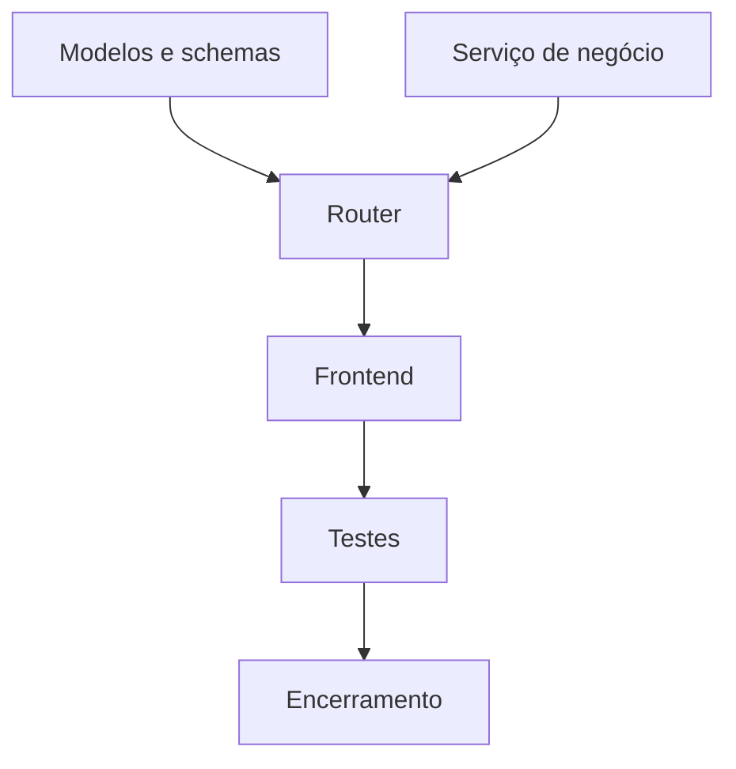
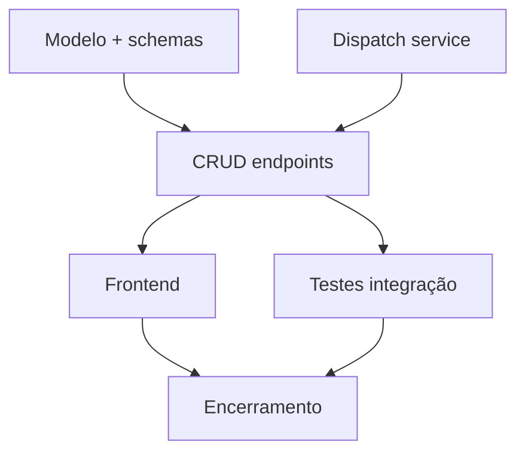

# Guia de Estrutura `.claude/` — Boas Práticas para Projetos com Claude Code

> **Para que serve:** Referência completa para montar e evoluir `.claude/` + `CLAUDE.md` no Claude Code.
> **Função:** Documentar settings, permissões, hooks, memória, subagents, MCP e roteiro de implantação — agnóstico a stack.

> Referência para construir uma estrutura `.claude/` madura em qualquer projeto. Cobre filosofia, CLAUDE.md, settings, hooks, memória, commands, subagents, MCP e planos de execução. Agnóstico a stack e domínio.

---

## Índice

1. [Filosofia e Objetivos](#1-filosofia-e-objetivos)
2. [Estrutura de Diretórios](#2-estrutura-de-diretórios)
3. [CLAUDE.md — A Constituição do Projeto](#3-claudemd--a-constituição-do-projeto)
4. [Settings — Configuração por Camada](#4-settings--configuração-por-camada)
5. [Permissões — Controle de Ferramentas](#5-permissões--controle-de-ferramentas)
6. [Hooks — Automação de Qualidade](#6-hooks--automação-de-qualidade)
7. [MCP Servers — Ferramentas Externas](#7-mcp-servers--ferramentas-externas)
8. [Memory — Persistência Entre Sessões](#8-memory--persistência-entre-sessões)
9. [Commands — Slash Commands Customizados](#9-commands--slash-commands-customizados)
10. [Subagents — Especialistas por Domínio](#10-subagents--especialistas-por-domínio)
11. [Plans e TodoWrite — Execução Estruturada](#11-plans-e-todowrite--execução-estruturada)
12. [Seleção de Modelos e Effort](#12-seleção-de-modelos-e-effort)
13. [Paralelismo Seguro com Worktrees](#13-paralelismo-seguro-com-worktrees)
14. [Melhoria Iterativa da Estrutura](#14-melhoria-iterativa-da-estrutura)
15. [Roteiro de Implantação](#15-roteiro-de-implantação)
16. [Anti-padrões Globais](#16-anti-padrões-globais)
17. [Checklist de Maturidade](#17-checklist-de-maturidade)

---

## 1. Filosofia e Objetivos

A estrutura `.claude/` é **infraestrutura de governança de IA** — define como o modelo deve pensar, agir e se auto-restringir durante o desenvolvimento. A diferença entre um time que usa Claude Code como ferramenta genérica e um time que o usa como parceiro de engenharia está na qualidade desta estrutura.

### 1.1 As Camadas de Contexto

Claude Code monta o contexto de cada sessão a partir de várias fontes, em ordem de prioridade crescente:

| Camada | Mecanismo | Escopo |
|--------|-----------|--------|
| Organização | CLAUDE.md via MDM/IT | Toda a organização |
| Usuário | `~/.claude/CLAUDE.md` | Todas as sessões do usuário |
| Projeto | `./CLAUDE.md` ou `./.claude/CLAUDE.md` | Repositório versionado |
| Local | `./CLAUDE.local.md` | Máquina individual (não commitado) |
| Memória | `~/.claude/projects/<proj>/memory/` | Persistência entre sessões |
| Hooks | `.claude/settings.json` → hooks | Pré/pós execução de ferramentas |
| MCP | `.claude/settings.json` → mcpServers | Ferramentas externas |

**Regra de ouro:** CLAUDE.md define o que nunca muda; memória registra o que foi aprendido; hooks garantem que qualidade não é opcional.

### 1.2 O que a Estrutura Não É

- Não é documentação para humanos lerem — é instrução para o modelo seguir.
- Não substitui revisão de código humana — amplifica a qualidade dela.
- Não é engessamento do processo — é um contrato sobre o que é não-negociável.

---

## 2. Estrutura de Diretórios

```
./                             # Raiz do projeto
├── CLAUDE.md                  # Constituição do projeto (versionada)
├── CLAUDE.local.md            # Overrides locais (gitignored)
│
└── .claude/
    ├── settings.json          # Configurações do projeto (versionadas)
    ├── settings.local.json    # Overrides locais (gitignored)
    │
    ├── hooks/                 # Scripts dos hooks
    │   ├── pre-tool-bash.sh   # Validação antes de comandos shell
    │   ├── post-tool-edit.sh  # Validação após edições de arquivo
    │   └── session-start.sh   # Inicialização de sessão
    │
    ├── commands/              # Slash commands do projeto
    │   ├── review.md
    │   ├── security-check.md
    │   ├── pr.md
    │   └── <domínio>/
    │       └── <comando>.md   # Namespace por subdiretório
    │
    └── agents/                # Definições de subagentes especializados
        ├── security-audit.md
        └── new-feature.md

~/.claude/                     # Configuração global do usuário
├── CLAUDE.md                  # Preferências pessoais (todos os projetos)
├── settings.json              # Settings globais
└── projects/<projeto>/
    └── memory/
        ├── MEMORY.md          # Índice de memórias (carregado em toda sessão)
        ├── user-prefs.md      # Preferências do usuário
        ├── feedback.md        # Correções aprendidas
        └── project-ctx.md     # Contexto do projeto em andamento
```

### Convenções de Nomenclatura

| Artefato | Padrão |
|----------|--------|
| Commands | `kebab-case.md` descritivo do fluxo |
| Commands em namespace | `<domínio>/<comando>.md` → `/domínio.comando` |
| Agents | `kebab-case.md` do papel especializado |
| Hooks | `<evento>-<tool>.sh` ou `<evento>-<descrição>.sh` |
| Memória | `<tipo>-<tópico>.md` (ex: `feedback-testing.md`) |

---

## 3. CLAUDE.md — A Constituição do Projeto

O `CLAUDE.md` é lido em toda sessão. Define as regras que não mudam — o contrato não-negociável do projeto.

### 3.1 Hierarquia de Carregamento

Claude Code caminha pela árvore de diretórios e carrega todos os CLAUDE.md encontrados, do mais distante ao mais próximo do CWD (arquivos mais próximos têm maior prioridade):

```
~/.claude/CLAUDE.md              ← usuário (preferências pessoais)
    /project/CLAUDE.md           ← projeto (regras do time)
    /project/CLAUDE.local.md     ← local (overrides pessoais, gitignored)
    /project/src/CLAUDE.md       ← subdiretório (carregado sob demanda)
```

**CLAUDE.md em subdiretórios** são carregados automaticamente quando Claude lê arquivos daquele diretório — use para documentar convenções específicas de um módulo.

**Importações:** use `@caminho/para/arquivo` dentro do CLAUDE.md para referenciar outros arquivos. O conteúdo é expandido no carregamento:

```markdown
<!-- CLAUDE.md -->
Veja @README.md para visão geral e @package.json para os scripts disponíveis.
```

### 3.2 O que Pertence no CLAUDE.md

```markdown
# Projeto — CLAUDE.md

## Visão Geral
Stack, domínio de negócio, contexto (regulatório, segurança, etc.)
Uma ou duas linhas — o modelo já vai ler o código.

## Arquitetura
Diagrama de diretórios com comentários sobre o papel de cada pasta.
Foque no não-óbvio: o que não está no nome do diretório.

## Comandos Essenciais
<!-- O modelo executa estes antes de qualquer ação -->
- Build: `<comando>`
- Teste: `<comando>`
- Lint: `<comando>`
- Deploy local: `<comando>`

## Padrões de Código
Exemplos mínimos (few-shot) de cada camada:
- Endpoint típico com autenticação
- Componente típico com HTTP
- Teste típico com fixture

## Regras Críticas de Segurança
- NUNCA hardcode X — usar variáveis de ambiente
- SEMPRE usar Y para validar Z
- Padrões de autenticação e autorização do projeto

## Requisitos Regulatórios / Compliance
O que é obrigatório, onde fica, quem valida.
(Omitir se não aplicável)

## Git e Commits
- Conventional Commits obrigatório
- Branches: feature/<nome>, fix/<nome>
- O que NUNCA commitar

## Arquivos Críticos
Lista dos arquivos que nunca devem ser editados em paralelo.

## Anti-padrões Proibidos
Lista explícita — o modelo respeita mais quando está escrita.
```

### 3.3 Limite de Tamanho

**Alvo: menos de 200 linhas** (ou 25KB). O CLAUDE.md consome espaço do context window em toda sessão. Conteúdo que muda frequentemente ou é longo demais vai em memória ou commands.

| Conteúdo | Onde vai |
|----------|----------|
| Regras estáticas do projeto | CLAUDE.md |
| Padrões de código por tecnologia (longos) | Commands com few-shot |
| Decisões e contexto em andamento | Memory |
| Checklists longos de compliance | Command ou Agent |
| Preferências pessoais do desenvolvedor | `~/.claude/CLAUDE.md` |
| Overrides de máquina | `CLAUDE.local.md` |

### 3.4 Few-Shot Examples no CLAUDE.md

Em vez de apenas descrever padrões em texto, inclua exemplos concretos. O modelo aprende muito mais com exemplos do que com descrições:

```markdown
## Padrão de Endpoint

Todo endpoint segue este formato:

```typescript
// ✅ Correto
export const createItem = async (req: Request, res: Response) => {
  const parsed = ItemSchema.safeParse(req.body);
  if (!parsed.success) {
    return res.status(400).json({ success: false, errors: parsed.error.issues });
  }
  const item = await ItemService.create(parsed.data);
  return res.status(201).json({ success: true, data: item });
};

// ❌ Errado — sem validação de schema, sem wrapper success/data
export const createItem = async (req, res) => {
  const item = await ItemService.create(req.body);
  res.json(item);
};
```

---

## 4. Settings — Configuração por Camada

### 4.1 Hierarquia de Escopos

```
① Organização (máxima prioridade) — MDM/IT, não pode ser overrido
② Linha de comando — flags passadas na invocação do CLI
③ Local  — .claude/settings.local.json (gitignored)
④ Projeto — .claude/settings.json (versionado)
⑤ Usuário — ~/.claude/settings.json (mínima prioridade)
```

**Comportamento de merge:** arrays de permissão se mesclam entre escopos. Regras `deny` sempre vencem, independentemente do escopo.

### 4.2 Estrutura Completa de `settings.json`

```json
{
  "$schema": "https://json.schemastore.org/claude-code-settings.json",

  "permissions": {
    "allow": [
      "Bash(npm run *)",
      "Bash(git commit *)",
      "Bash(git diff *)",
      "Read(src/**)",
      "Edit(src/**)"
    ],
    "ask": [
      "Bash(git push *)",
      "Bash(docker *)"
    ],
    "deny": [
      "Bash(rm -rf *)",
      "Bash(curl *)",
      "Read(.env)",
      "Read(./secrets/**)"
    ],
    "defaultMode": "default"
  },

  "env": {
    "NODE_ENV": "development",
    "LOG_LEVEL": "debug"
  },

  "model": "claude-sonnet-4-6",
  "effortLevel": "high",

  "mcpServers": {
    "github": {
      "type": "stdio",
      "command": "npx",
      "args": ["-y", "@modelcontextprotocol/server-github"],
      "env": {
        "GITHUB_TOKEN": "${GITHUB_TOKEN}"
      }
    }
  },

  "hooks": {
    "PreToolUse": [
      {
        "matcher": "Bash",
        "hooks": [
          {
            "type": "command",
            "command": ".claude/hooks/pre-tool-bash.sh",
            "timeout": 15
          }
        ]
      }
    ],
    "PostToolUse": [
      {
        "matcher": "Edit|Write",
        "hooks": [
          {
            "type": "command",
            "command": ".claude/hooks/post-tool-edit.sh"
          }
        ]
      }
    ]
  },

  "autoMemoryEnabled": true
}
```

### 4.3 Campos Principais

| Campo | Tipo | Descrição |
|-------|------|-----------|
| `permissions` | object | allow/ask/deny rules + defaultMode |
| `env` | object | Variáveis de ambiente injetadas |
| `model` | string | Modelo padrão da sessão |
| `effortLevel` | string | low / medium / high / xhigh |
| `mcpServers` | object | Servidores MCP conectados |
| `hooks` | object | Handlers de eventos do ciclo de vida |
| `autoMemoryEnabled` | bool | Ativar/desativar memória automática |
| `claudeMdExcludes` | array | Padrões de CLAUDE.md a ignorar |
| `defaultMode` | string | Modo padrão de permissão |

### 4.4 `settings.local.json` — Overrides Pessoais

Para configurações que variam por máquina ou desenvolvedor, sem commitar:

```json
// .claude/settings.local.json (gitignored)
{
  "env": {
    "DATABASE_URL": "postgresql://localhost:5432/myapp_dev",
    "REDIS_URL": "redis://localhost:6379"
  },
  "model": "claude-opus-4-7",
  "permissions": {
    "allow": [
      "Bash(psql *)",
      "Bash(redis-cli *)"
    ]
  }
}
```

Adicionar ao `.gitignore`:
```gitignore
.claude/settings.local.json
CLAUDE.local.md
```

---

## 5. Permissões — Controle de Ferramentas

### 5.1 Ordem de Avaliação

```
deny → ask → allow → defaultMode
```

Primeiro match vence. Se nenhuma regra combina, aplica `defaultMode`.

### 5.2 Formatos de Especificador

| Padrão | Exemplo | Comportamento |
|--------|---------|---------------|
| `Tool` | `Bash` | Todos os usos da ferramenta |
| `Tool(*)` | `Bash(*)` | Equivalente a `Tool` |
| `Tool(valor exato)` | `Bash(npm run build)` | Apenas este comando |
| `Tool(prefixo *)` | `Bash(npm run *)` | Qualquer comando iniciando com prefixo |
| `Tool(* sufixo)` | `Bash(* --version)` | Qualquer prefixo, sufixo fixo |

### 5.3 Exemplos por Categoria

**Bash — comandos de desenvolvimento:**
```json
{
  "allow": [
    "Bash(npm run *)",
    "Bash(git add *)",
    "Bash(git commit *)",
    "Bash(git diff *)",
    "Bash(git log *)",
    "Bash(* --help)",
    "Bash(* --version)"
  ],
  "ask": [
    "Bash(git push *)",
    "Bash(docker-compose *)"
  ],
  "deny": [
    "Bash(rm -rf *)",
    "Bash(curl *)",
    "Bash(wget *)",
    "Bash(sudo *)"
  ]
}
```

**Arquivos — controle de leitura/escrita:**
```json
{
  "allow": [
    "Read(src/**)",
    "Edit(src/**)",
    "Write(src/**)"
  ],
  "deny": [
    "Read(.env)",
    "Read(.env.*)",
    "Read(./secrets/**)",
    "Read(~/.ssh/**)",
    "Edit(.github/workflows/**)"
  ]
}
```

**MCP tools:**
```json
{
  "allow": [
    "mcp__github__*",
    "mcp__linear__list_issues",
    "mcp__linear__create_issue"
  ],
  "deny": [
    "mcp__github__delete_repository"
  ]
}
```

### 5.4 Modos de Permissão (`defaultMode`)

| Modo | Comportamento | Quando usar |
|------|--------------|-------------|
| `default` | Prompta em primeiro uso de cada tool | Desenvolvimento interativo |
| `plan` | Apenas lê — sem edições ou execuções | Revisão e análise |
| `acceptEdits` | Auto-aprova edições em working directory | Refactorings longos |
| `auto` | Auto-aprova com safety checks em background | Automação confiável |
| `dontAsk` | Nega tudo exceto pré-aprovado em `allow` | Ambiente restrito |
| `bypassPermissions` | Pula todos os prompts | Automação total (usar com cuidado) |

### 5.5 Estratégia de Permissões por Ambiente

**Desenvolvimento interativo** (`.claude/settings.json`):
```json
{ "defaultMode": "default" }
```

**CI/CD ou automação** (via flag ou env):
```bash
claude --permission-mode acceptEdits --model sonnet
```

**Revisão de código segura** (sem edições acidentais):
```bash
claude --permission-mode plan
```

---

## 6. Hooks — Automação de Qualidade

Hooks executam antes, durante ou após eventos do ciclo de vida do Claude Code. São a garantia de qualidade que não depende de o desenvolvedor lembrar de rodar verificações.

### 6.1 Ciclo de Vida

```
SessionStart → [Por turno: UserPromptSubmit → Loop agentic → Stop] → SessionEnd
                              ↕ PreToolUse / PostToolUse (a cada tool call)
```

### 6.2 Eventos Disponíveis

| Evento | Cadência | Matcher | Uso típico |
|--------|----------|---------|------------|
| `SessionStart` | 1x por sessão | startup, resume | Carregar contexto, atualizar grafo |
| `UserPromptSubmit` | 1x por turno | — | Validar prompt antes de processar |
| `PreToolUse` | Antes de cada tool | Bash, Edit, Write, Read, MCP... | Bloquear comandos perigosos |
| `PostToolUse` | Após cada tool | Bash, Edit, Write... | Rodar linter após edição |
| `Stop` | 1x por turno | — | Logging, notificações |
| `SessionEnd` | 1x por sessão | — | Cleanup, persistir memória |

### 6.3 Configuração no `settings.json`

```json
{
  "hooks": {
    "PreToolUse": [
      {
        "matcher": "Bash",
        "hooks": [
          {
            "type": "command",
            "command": ".claude/hooks/pre-tool-bash.sh",
            "timeout": 15
          }
        ]
      }
    ],
    "PostToolUse": [
      {
        "matcher": "Edit|Write",
        "hooks": [
          {
            "type": "command",
            "command": ".claude/hooks/post-edit-lint.sh"
          }
        ]
      }
    ],
    "SessionStart": [
      {
        "matcher": "startup",
        "hooks": [
          {
            "type": "command",
            "command": ".claude/hooks/session-start.sh"
          }
        ]
      }
    ]
  }
}
```

### 6.4 Matcher Patterns

| Padrão | Tipo | Exemplo |
|--------|------|---------|
| `"Bash"` | Exato | Só a ferramenta Bash |
| `"Edit\|Write"` | OR lógico | Edit ou Write |
| `"mcp__github__.*"` | Regex JS | Qualquer tool do servidor GitHub |
| `"startup"` | Literal (SessionStart) | Apenas no início |
| `""` ou `"*"` | Qualquer | Dispara em toda ocorrência |

### 6.5 Formato de Input e Output

**Input recebido pelo script (stdin como JSON):**
```json
{
  "session_id": "abc123",
  "hook_event_name": "PreToolUse",
  "cwd": "/path/to/project",
  "tool_name": "Bash",
  "tool_input": {
    "command": "rm -rf dist/"
  }
}
```

**Output esperado (stdout como JSON):**
```json
{
  "continue": true,
  "suppressOutput": false,
  "hookSpecificOutput": {
    "permissionDecision": "deny",
    "permissionDecisionReason": "Use npm run clean instead of rm -rf"
  }
}
```

**Exit codes:**
- `0` — sucesso (JSON no stdout)
- `2` — erro bloqueante (stderr é enviado ao Claude)
- Outro — erro não-bloqueante (logado, execução continua)

### 6.6 Hook: Validação de Comandos Bash

```bash
#!/bin/bash
# .claude/hooks/pre-tool-bash.sh

INPUT=$(cat)
COMMAND=$(echo "$INPUT" | jq -r '.tool_input.command // ""')

# Bloquear padrões perigosos
DANGEROUS_PATTERNS=(
  "rm -rf /"
  "dd if="
  "> /dev/sd"
  "chmod 777"
  "curl.*\|.*sh"  # pipe curl para shell
)

for pattern in "${DANGEROUS_PATTERNS[@]}"; do
  if echo "$COMMAND" | grep -qE "$pattern"; then
    jq -n \
      --arg reason "Comando bloqueado por política de segurança: $pattern" \
      '{hookSpecificOutput: {permissionDecision: "deny", permissionDecisionReason: $reason}}'
    exit 0
  fi
done

# Permitir
echo '{"continue": true}'
exit 0
```

### 6.7 Hook: Linter Após Edição

```bash
#!/bin/bash
# .claude/hooks/post-edit-lint.sh

INPUT=$(cat)
FILE=$(echo "$INPUT" | jq -r '.tool_input.path // ""')

# Só rodar se o arquivo for código fonte
if [[ "$FILE" =~ \.(ts|tsx|js|jsx)$ ]]; then
  npx eslint "$FILE" --quiet 2>&1
  if [ $? -ne 0 ]; then
    # Exit 2 = erro bloqueante, enviado ao Claude para corrigir
    echo "Lint falhou em $FILE. Corrija antes de continuar." >&2
    exit 2
  fi
fi

exit 0
```

### 6.8 Hook: Atualização de Contexto na Sessão

```bash
#!/bin/bash
# .claude/hooks/session-start.sh

TS_FILE=".claude/.session_hook_ts"
INTERVAL=${GRAPH_SESSION_INTERVAL:-14400}  # 4h padrão

if [ -f "$TS_FILE" ]; then
  LAST=$(cat "$TS_FILE")
  NOW=$(date +%s)
  DIFF=$((NOW - LAST))
  if [ $DIFF -lt $INTERVAL ]; then
    exit 0  # Throttle — não atualizar ainda
  fi
fi

# Atualizar knowledge graph ou índice em background
<comando-de-atualização> &

date +%s > "$TS_FILE"
exit 0
```

### 6.9 Boas Práticas para Hooks

| Regra | Motivo |
|-------|--------|
| Hooks devem completar em < 15s | Latência alta trava o fluxo |
| Exit 2 apenas para erros reais bloqueantes | Não abuse — o Claude para e tenta corrigir |
| Mensagem de erro deve ser acionável | "Rode `npm run lint` para corrigir" > "Lint falhou" |
| Throttle em SessionStart | Evita re-execução desnecessária |
| Não fazer chamadas de rede síncronas longas | Use background (`&`) ou hooks assíncronos |
| Testar manualmente antes de ativar | `echo '{"tool_input":{"command":"rm -rf ."}}' \| bash .claude/hooks/pre-tool-bash.sh` |

---

## 7. MCP Servers — Ferramentas Externas

### 7.1 O que é MCP

O Model Context Protocol conecta o Claude Code a sistemas externos — bancos de dados, APIs, ferramentas de gestão — de forma padronizada. Com MCP, o modelo pode consultar issues, verificar schemas, ler logs de produção, tudo dentro do fluxo de desenvolvimento.

### 7.2 Configuração em `settings.json`

```json
{
  "mcpServers": {
    "github": {
      "type": "stdio",
      "command": "npx",
      "args": ["-y", "@modelcontextprotocol/server-github"],
      "env": {
        "GITHUB_TOKEN": "${GITHUB_TOKEN}"
      }
    },
    "postgres": {
      "type": "stdio",
      "command": "node",
      "args": [".claude/mcp/postgres-server.js"],
      "env": {
        "DATABASE_URL": "${DATABASE_URL}"
      },
      "timeout": 30
    },
    "linear": {
      "type": "stdio",
      "command": "npx",
      "args": ["-y", "@linear/mcp-server"],
      "env": {
        "LINEAR_API_KEY": "${LINEAR_API_KEY}"
      }
    }
  }
}
```

### 7.3 Campos por Tipo de Servidor

**Tipo `stdio` (mais comum):**

| Campo | Obrigatório | Descrição |
|-------|-------------|-----------|
| `type` | Sim | `"stdio"` |
| `command` | Sim | Executável |
| `args` | Não | Array de argumentos |
| `env` | Não | Variáveis de ambiente |
| `timeout` | Não | Timeout em segundos (padrão: 60) |

**Tipo `http`:**

| Campo | Obrigatório | Descrição |
|-------|-------------|-----------|
| `type` | Sim | `"http"` |
| `url` | Sim | URL do servidor MCP |
| `headers` | Não | Headers HTTP |

### 7.4 Variáveis de Ambiente em MCP

Use sempre `${VAR}` — o Claude Code expande da variável de ambiente do processo:

```json
{
  "env": {
    "API_KEY": "${MY_API_KEY}",
    "BASE_URL": "${API_BASE_URL:-https://api.example.com}"
  }
}
```

Documentar variáveis necessárias em `.env.example`:
```bash
# .env.example — Variáveis necessárias para MCP servers
GITHUB_TOKEN=ghp_xxx         # GitHub Personal Access Token (repo scope)
LINEAR_API_KEY=lin_api_xxx   # Linear API Key (Settings > API)
DATABASE_URL=postgresql://...  # Apenas ambiente de desenvolvimento
```

### 7.5 Controlando Acesso a MCP via Permissões

```json
{
  "permissions": {
    "allow": [
      "mcp__github__list_repositories",
      "mcp__github__get_pull_request",
      "mcp__linear__*"
    ],
    "deny": [
      "mcp__github__delete_repository",
      "mcp__github__delete_branch"
    ]
  }
}
```

### 7.6 Casos de Uso por Categoria

| Categoria | Exemplos de MCP | Benefício |
|-----------|----------------|-----------|
| Gestão de código | GitHub, GitLab | PRs e issues sem sair do chat |
| Gestão de projeto | Linear, Jira, Notion | Tickets e documentação em contexto |
| Dados e infra | PostgreSQL, Redis, MongoDB | Consultar esquema e dados de dev |
| Observabilidade | Datadog, Grafana | Logs e métricas em contexto |
| Comunicação | Slack | Notificações e histórico de decisões |

### 7.7 Boas Práticas para MCP

| Regra | Motivo |
|-------|--------|
| Credenciais sempre via `${VAR}` | Nunca hardcode em JSON versionado |
| MCP de banco: apenas desenvolvimento | Nunca apontar para produção |
| Desativar servidores não usados | Reduz superfície de ataque e tokens |
| Documentar variáveis em `.env.example` | Facilita onboarding |
| Combinar com regras `deny` para operações destrutivas | MCP com delete exposto é risco |

---

## 8. Memory — Persistência Entre Sessões

### 8.1 Por que Memory Importa

Sem memória, cada sessão começa do zero. O modelo repete os mesmos erros, faz as mesmas perguntas, ignora correções que já foram dadas. Com memória estruturada, o modelo acumula conhecimento sobre o projeto, o usuário e as decisões do time.

### 8.2 Os Quatro Tipos de Memória

| Tipo | Propósito | Quando salvar |
|------|-----------|---------------|
| **user** | Papel, preferências, nível de expertise do desenvolvedor | Ao aprender sobre quem é o usuário |
| **feedback** | Correções e confirmações sobre abordagem | Quando o usuário corrige ("não faça isso") ou confirma ("exato, continue assim") |
| **project** | Decisões, contexto em andamento, estado atual | Ao aprender sobre iniciativas, bugs, prazos |
| **reference** | Ponteiros para recursos externos | Ao aprender onde ficam informações externas |

### 8.3 Estrutura dos Arquivos de Memória

**Frontmatter obrigatório:**
```markdown
---
name: feedback-testing-approach
description: Abordagem de testes preferida — sem mock de banco de dados
metadata:
  type: feedback
---

Não mockar banco de dados em testes de integração.

**Why:** O time foi afetado por uma migração que passou em testes mockados mas
falhou em produção porque o schema real divergiu do mock.

**How to apply:** Em testes que exercem lógica de banco, usar banco real
com dados de fixture. Mock apenas para serviços externos (APIs de terceiros).
```

**Tipos de memória e campos:**

```markdown
<!-- Tipo: user -->
---
name: user-role
description: Papel e expertise do desenvolvedor
metadata:
  type: user
---
Desenvolvedor sênior com 8 anos em Python, novo em TypeScript.
Preferência por exemplos comparando com Python quando explicar TS.

<!-- Tipo: project -->
---
name: project-auth-rewrite
description: Reescrita do módulo de auth em andamento
metadata:
  type: project
---
O módulo de autenticação está sendo reescrito (branch: feature/auth-v2).

**Why:** Compliance exige token rotation a cada 15 minutos — o código atual
não suporta isso sem refactor maior.

**How to apply:** Ao sugerir mudanças em auth, verificar se estão alinhadas
com a nova arquitetura em feature/auth-v2.

<!-- Tipo: reference -->
---
name: ref-linear-bugs
description: Bugs são rastreados no Linear, projeto CORE
metadata:
  type: reference
---
Bugs de produção: Linear projeto "CORE" — usar para contexto de tickets.
Runbooks: Notion em /Engenharia/Runbooks/
```

### 8.4 MEMORY.md — O Índice

```markdown
# MEMORY.md
<!-- Carregado em toda sessão. Máx 200 linhas / 25KB. Apenas ponteiros. -->

## Usuário
- [Perfil do desenvolvedor](user-role.md) — sênior Python, novo em TS

## Feedback
- [Abordagem de testes](feedback-testing.md) — sem mock de banco
- [Estilo de commits](feedback-commits.md) — Conventional Commits, inglês
- [Formato de resposta](feedback-response.md) — conciso, sem resumos no final

## Projeto
- [Reescrita de auth](project-auth-rewrite.md) — em andamento, branch feature/auth-v2
- [Freeze de merge](project-merge-freeze.md) — até 2026-06-01 para release mobile

## Referências
- [Bugs (Linear)](ref-linear-bugs.md) — projeto CORE
- [Runbooks (Notion)](ref-runbooks.md) — /Engenharia/Runbooks/
```

**MEMORY.md deve ter:**
- Apenas ponteiros (uma linha por memória)
- Descrição scanning-friendly — o modelo decide se lê o arquivo completo
- Máximo 200 linhas — linhas além são truncadas

### 8.5 O que NÃO Salvar em Memória

- Padrões de código — pertencem ao CLAUDE.md
- Histórico de git — `git log` é autoritativo
- Soluções de bug — a correção está no código; o contexto no commit
- Listas de PRs ou atividade recente — ficam obsoletas rápido
- Qualquer coisa já documentada em CLAUDE.md

### 8.6 Memória Automática (Auto Memory)

Com `autoMemoryEnabled: true`, o Claude pode salvar memórias automaticamente ao trabalhar. O ciclo de consolidação ("dream") ocorre quando:
- 24+ horas desde a última consolidação, **e**
- 5+ novas sessões acumuladas

Para consolidar manualmente: `/memory` → `dream` no chat.

---

## 9. Commands — Slash Commands Customizados

### 9.1 O que são Commands

Commands são arquivos `.md` em `.claude/commands/` que se tornam slash commands disponíveis no chat. Quando o usuário digita `/review`, o Claude executa o conteúdo do arquivo como instrução.

**Locais de carregamento:**

| Local | Escopo |
|-------|--------|
| `.claude/commands/` | Projeto (versionado, compartilhado) |
| `~/.claude/commands/` | Usuário (todos os projetos) |

### 9.2 Anatomia de um Command

```markdown
---
description: "Revisa mudanças não commitadas por qualidade e segurança"
allowed-tools:
  - Bash
  - Read
  - Grep
---

# /review

Revisa as mudanças atuais antes do commit.

## Fluxo

### 1. Qualidade de Código
Execute os linters do projeto: `<comando de lint>`
Se houver erros: listar cada um com arquivo:linha e descrição.

### 2. Segurança
Verificar no diff:
- Credenciais hardcoded (strings que parecem tokens, senhas, chaves)
- Inputs externos sem validação
- Endpoints sem autenticação
- Arquivos de configuração sensíveis staged

### 3. Consistência
- Novos tipos alinhados com os existentes?
- Convenções de naming seguidas?
- Testes cobrindo os novos casos?

## Saída
Sumário por categoria: ✅ OK / ⚠️ Atenção / ❌ Crítico
Não corrigir automaticamente — apresentar e aguardar aprovação.
```

### 9.3 Usando `$ARGUMENTS`

`$ARGUMENTS` é substituído pelo texto digitado após o nome do command:

```markdown
---
description: "Verifica segurança de um arquivo específico"
---

# /security-check

Analisa `$ARGUMENTS` por vulnerabilidades de segurança.

## Verificações
1. Credenciais hardcoded
2. Inputs externos sem validação
3. Risco de injection (SQL, OS command, template)
4. Dados sensíveis expostos em logs ou respostas

Arquivo: `$ARGUMENTS`
```

Uso: `/security-check src/api/auth.ts`

### 9.4 Organizando em Namespaces

Subdiretórios criam namespaces:

```
.claude/commands/
├── review.md                → /review
├── pr.md                    → /pr
├── deploy/
│   ├── staging.md           → /deploy.staging
│   └── production.md        → /deploy.production
└── debug/
    ├── logs.md              → /debug.logs
    └── database.md          → /debug.database
```

### 9.5 Commands Essenciais para Qualquer Projeto

**`/review` — Revisão antes do commit:**
```markdown
---
description: "Revisa diff atual: lint, segurança, consistência"
allowed-tools: [Bash, Read, Grep]
---
Execute lint, verifique segurança no diff, verifique consistência com padrões do projeto.
Retorne sumário categorizado. Não corrija sem aprovação.
```

**`/security-check` — Auditoria de segurança:**
```markdown
---
description: "Auditoria rápida de segurança no diff atual"
allowed-tools: [Bash, Read, Grep]
---
Verifique: credenciais hardcoded, inputs sem validação, auth ausente,
dados sensíveis em logs, dependências sem versão fixada.
Retorne relatório: ✅ OK / ⚠️ Atenção / ❌ Crítico.
```

**`/pr` — Criar pull request:**
```markdown
---
description: "Commit, push e abre PR com descrição gerada do diff"
allowed-tools: [Bash, Read]
---
1. `git diff` para entender as mudanças
2. Se lint não passou: avisar e aguardar confirmação
3. Mensagem de commit com Conventional Commits
4. `git add` → `git commit` → `git push`
5. `gh pr create` com título < 70 chars e body com mudanças + checklist de testes
Nunca incluir .env ou secrets no commit. Nunca force push sem confirmação.
```

**`/plano` — Criar plano de execução:**

```markdown
---
description: "Gera plano multiagente em .claude/plans/<slug>_<hash>.plan.md"
allowed-tools: [Bash, Read, Glob, Grep]
---
# /plano

Gera um plano multiagente em `.claude/plans/<slug>_<hash>.plan.md`.
Nunca começar a escrever o plano antes de completar o discovery.

## Fase 1 — Discovery (obrigatório antes de qualquer escrita)

Execute na ordem abaixo e registre os achados em memória de trabalho:

### 1a. Estado atual do repositório
- `git status` → há mudanças em andamento? Em qual branch?
- `git diff --stat` → quais arquivos já foram tocados?
- `git log --oneline -5` → qual foi a última entrega? Que padrão de commit o time usa?

### 1b. Escopo da tarefa
- O que o usuário pediu, palavra por palavra
- Qual é o objetivo de negócio por trás (não apenas o técnico)
- Existe ticket/issue referenciado? Ler se sim.

### 1c. Mapeamento de arquivos afetados
Para cada entidade/domínio na tarefa:
- Onde fica o modelo/schema? Existe um similar como padrão?
- Onde fica o serviço/lógica? Qual é o arquivo de referência?
- Onde fica o router/controller? Qual é o padrão de rota existente?
- Onde ficam os testes? Qual é o padrão de fixture?
- Onde fica o frontend equivalente (se aplicável)?

### 1d. Identificar arquivos críticos
Verificar CLAUDE.md e histórico do projeto. Marcar os arquivos da tarefa que
são ponto de entrada, config central, auth ou orquestração.

### 1e. Identificar padrões reutilizáveis
Abrir 1-2 arquivos similares ao que será criado. Registrar:
- Estrutura de imports
- Padrão de naming
- Padrão de error handling
- Padrão de auditoria/log (se regulatório)

### 1f. Ambiguidades
Se após o discovery o escopo ainda não estiver claro: **parar e perguntar**.
Não inventar escopo. Uma pergunta bem feita aqui evita retrabalho depois.

---

## Fase 2 — Particionamento em Fases

Regras de particionamento:

**Uma fase = uma unidade entregável coesa.**
- Não misturar backend e frontend na mesma fase se puder ser paralelo
- Não misturar criação de model com criação de router (dependência!)
- Testes ficam na mesma fase que o código OU em fase própria (se complexos)

**Ordem natural de dependência:**
```
Models/Schemas → Services/Logic → Routers/Controllers → Tests → Frontend → Encerramento
```
Fases sem dependência entre si → candidatas a paralelo.
Fases que compartilham arquivo crítico → serializar.

**Limites:**
- Mínimo 2 fases (trivial não vira plano)
- Máximo 8 fases por plano (dividir em 2 planos se passar)
- Cada fase: máximo 25 linhas no `.plan.md`

---

## Fase 3 — Seleção de Modelos por Fase

Para cada fase, classificar a complexidade e atribuir o tier mínimo suficiente:

| Tipo de trabalho na fase | Tier |
|--------------------------|------|
| Criar arquivo seguindo padrão existente (1 arquivo) | haiku |
| Refactor mecânico em múltiplos arquivos | haiku |
| Lógica nova simples sem dependências complexas | sonnet |
| Integrar módulos com dependências cruzadas | sonnet |
| Decisão de design com 2+ opções não óbvias | sonnet (effortLevel: high) |
| Segurança, auth, compliance | opus |

---

## Fase 4 — Escrita do Plano

Regras de escrita:
- Contexto: tabela, máx 40 linhas, apenas fatos descobertos (não suposições)
- Mermaid: IDs F1..FN, arestas apenas onde há dependência real
- Cada fase: objetivo + arquivos + mudanças comportamentais + checklist
- Mudanças: descrever O QUÊ muda de comportamento, não como implementar
  ✅ "Adicionar endpoint GET /items/ com paginação e autenticação JWT"
  ❌ "Criar função async def list_items(): return await db.find_all()"
- Encerramento: critério mensurável (comando que retorna 0, não "tudo ok")

## Saída
Salvar em `.claude/plans/<slug>_<hash8>.plan.md` onde hash8 são os primeiros
8 caracteres de `git rev-parse HEAD`. Exibir resumo ao usuário: fases,
batches de paralelo, modelo sugerido por fase.
```

**`/multiagent` — Executar plano em paralelo:**

```markdown
---
description: "Executa .plan.md em batches de subagents paralelos com worktree"
allowed-tools: [Bash, Read, Agent, TodoWrite]
---
# /multiagent

Executa um plano `.plan.md` em batches de subagents paralelos.
Recebe como argumento o caminho do arquivo: `/multiagent .claude/plans/plano.plan.md`

## Fase 1 — Parse e Validação do Plano

### 1a. Ler o plano
- Ler o frontmatter: extrair lista de todos os F-IDs e seus status
- Ler `## Diagrama de dependências`: extrair o grafo Mermaid
  Construir mentalmente: quais fases dependem de quais?
  Exemplo: `F1 --> F3` significa F3 só pode rodar após F1 completar.

### 1b. Construir batches de execução
Algoritmo:
1. Identificar fases sem nenhuma dependência pendente → Batch 1
2. Após Batch 1 completar: quais fases ficam desbloqueadas? → Batch 2
3. Repetir até esgotar todas as fases
4. Encerramento sempre fica no último batch sozinho

Exemplo para o grafo `F1→F3, F2→F3, F3→F4, F4→F5`:
- Batch 1: [F1, F2] → paralelo (sem dependências)
- Batch 2: [F3] → sequencial (depende de F1 e F2)
- Batch 3: [F4] → sequencial
- Batch 4: [F5 — Encerramento]

### 1c. Validar disjunção de arquivos (OBRIGATÓRIO antes de paralelizar)
Para cada batch com 2+ fases:
- Listar os arquivos de cada fase (seção "Arquivos" de cada fase)
- Verificar interseção: algum arquivo aparece em 2 fases do mesmo batch?
- Se sim: mover a fase conflitante para o próximo batch
- Verificar CLAUDE.md: algum arquivo é marcado como crítico?
  Se sim: aquela fase nunca pode estar em paralelo com qualquer outra.

---

## Fase 2 — Execução dos Batches

Para cada batch, executar as fases em paralelo via Agent com `isolation: "worktree"`:

### Contexto que cada subagent recebe
Cada subagent de fase recebe APENAS:
1. A seção `## Contexto` do plano (tabela com referências e arquivos críticos)
2. As convenções do projeto (resumo do CLAUDE.md relevante)
3. A seção `## Fase FN` específica dele (objetivo, arquivos, mudanças, checklist)
4. A instrução: "Ao terminar, criar `.claude/plans/agent-FN-done.md` com
   sumário do que foi feito e qualquer divergência do plano."

**Não enviar o plano inteiro para cada subagent** — apenas o contexto necessário.

### Durante a execução
- Aguardar todos os subagents do batch terminarem antes de iniciar o próximo
- Monitorar: se um subagent retornar erro ou não criar o arquivo `done`, pausar
  e reportar ao usuário antes de continuar
- TodoWrite: marcar cada fase como `in_progress` ao iniciar, `completed` ao terminar

---

## Fase 3 — Consolidação Pós-Batch

Após cada batch (especialmente batches paralelos), verificar:

### 3a. Consistência entre fases paralelas
- Os arquivos criados por F1 e F2 (se paralelos) têm imports compatíveis?
- Há nomes de variável/tipo que divergem entre as fases?
- Alguma fase criou arquivo que o plano não previa?

### 3b. Integração em arquivos compartilhados
Se uma fase próxima precisa registrar algo em arquivo crítico
(ex: ponto de entrada, router principal):
- Fazer esta integração manualmente, não delegar a subagent
- Verificar que o arquivo crítico não foi tocado por fase não autorizada

### 3c. Arquivos `done`
Ler cada `.claude/plans/agent-FN-done.md`:
- A fase cumpriu o objetivo declarado?
- Houve divergência do plano? Se sim: o impacto afeta fases seguintes?
- Atualizar `todo.status` da fase para `completed`

---

## Fase 4 — Encerramento

Executar apenas após todos os batches anteriores consolidados:

1. Rodar o comando de validação do projeto (`## Encerramento` do plano)
2. Se falhar: identificar a fase responsável, corrigir, revalidar
3. Rodar lint separadamente se não incluso na validação
4. Confirmar: todos os `todo.status` = `completed`?
5. Remover arquivos `agent-FN-done.md` temporários
6. Reportar ao usuário: o que foi feito, o que passou, se há pendências

## Regras Absolutas
- Nunca paralelizar fases com arquivo em comum — sem exceções
- Nunca declarar sucesso antes da validação passar
- Nunca avançar batch com falha não resolvida no batch anterior
- Falha em subagent: pausar e reportar ao usuário com contexto completo
```

### 9.6 Boas Práticas para Commands

| Regra | Motivo |
|-------|--------|
| `allowed-tools` explícito | Mínimo privilégio — o command só usa o que precisa |
| `description` rico | Aparece no autocomplete e ajuda o modelo a sugerir o command |
| Saída esperada definida | O usuário sabe o que aconteceu |
| Confirmar antes de ações destrutivas | Dados perdidos não voltam |
| Não duplicar lógica de CLAUDE.md | Commands referenciam regras, não repetem |

---

## 10. Subagents — Especialistas por Domínio

### 10.1 O que são Subagents

Subagents são instâncias separadas do Claude invocadas pela instância principal para executar tarefas especializadas. Cada subagent tem seu próprio contexto, ferramentas e escopo — e pode trabalhar em paralelo com outros subagents usando worktrees isoladas.

### 10.2 Definição de um Subagent

```markdown
<!-- .claude/agents/security-audit.md -->
---
description: >
  Auditoria de segurança readonly. Verifica autenticação, validação de inputs,
  credenciais hardcoded e configurações de infra. Nunca modifica código.
model: claude-opus-4-7
tools:
  - Read
  - Grep
  - Glob
  - Bash
disallowedTools:
  - Edit
  - Write
maxTurns: 20
---

# Agent: Security Audit

## Objetivo
Executar auditoria de segurança abrangente, produzindo relatório com achados por severidade.

## Escopo

### 1. Autenticação e Autorização
- Todo endpoint sensível tem proteção?
- Verificação de permissão no lugar correto (middleware vs ad-hoc)?
- Alguma rota sem proteção que deveria ter?

### 2. Validação de Inputs
- Inputs externos validados com schema antes de usar?
- Risco de injection (SQL, NoSQL, OS command, template)?
- Uploads com validação de tipo e tamanho no servidor?

### 3. Credenciais e Configuração
- Strings literais que parecem credenciais?
- Variáveis de ambiente lidas corretamente?
- Arquivos de configuração sensíveis em `.gitignore`?

### 4. Dados e Privacidade
- PII ou dados sensíveis em logs?
- Respostas de API expõem mais do que o necessário?

## Saída
Arquivo `docs/security-audit-<YYYY-MM-DD>.md` com:
- Sumário executivo
- Achados por severidade: CRÍTICO / ALTO / MÉDIO / BAIXO / INFO
- Para cada achado: localização, descrição, recomendação

## Constraints
- READONLY — disallowedTools proíbe Edit e Write
- Achados CRÍTICO: reportar imediatamente, não apenas no arquivo
- Nunca incluir credenciais encontradas no relatório
```

### 10.3 Parâmetros de Subagent

| Parâmetro | Tipo | Descrição |
|-----------|------|-----------|
| `model` | string | Modelo do subagent (pode diferir do parent) |
| `tools` | array | Ferramentas permitidas |
| `disallowedTools` | array | Ferramentas explicitamente bloqueadas |
| `maxTurns` | int | Limite de iterações |
| `description` | string | Usado para routing e seleção |

### 10.4 Isolamento por Worktree

Para subagents que editam código em paralelo, use `isolation: "worktree"`:

```markdown
# No command ou agent que spawna subagents:

Spawn subagent com isolation="worktree" para cada fase paralela:
- Fase F1: modifica src/models/ → worktree-1
- Fase F2: modifica src/components/ → worktree-2
Aguardar ambos completar antes de merge.
```

**Benefícios do worktree:**
- Edições paralelas sem colisão de arquivos
- Estado isolado por agente (sem interferência no branch principal)
- Limpeza automática após conclusão (se sem mudanças) ou retorno do branch

### 10.5 Quando Usar Subagents

| Usar subagent | Não usar subagent |
|---------------|-------------------|
| Tarefa tem escopo claro e separado | Tarefa requer decisões mid-execution |
| Paralelismo com arquivos disjuntos | Escopo ambíguo ou subjetivo |
| Especialização de domínio (segurança, testes) | Tarefa simples que o agente principal resolve |
| Trabalho longo que pode poluir o contexto principal | Quando context sharing é necessário |

### 10.6 Boas Práticas para Subagents

| Regra | Motivo |
|-------|--------|
| `disallowedTools` explícito em agents readonly | Previne modificação acidental |
| `description` rica | Usada para routing automático — seja específico |
| `maxTurns` definido | Evita loops infinitos em subagents |
| Critério de conclusão mensurável | O subagent sabe quando parar |
| Worktree para edições paralelas | Sem worktree, conflitos em arquivos compartilhados |

---

## 11. Plans e TodoWrite — Execução Estruturada

### 11.1 TodoWrite — Rastreamento de Progresso

`TodoWrite` é a ferramenta de tracking de tasks do Claude Code. Usá-la proativamente demonstra estrutura, permite que o usuário acompanhe progresso e garante que nada seja esquecido em tarefas complexas.

**Estrutura de uma task:**
```python
{
  "content": "Implementar autenticação OAuth",   # forma imperativa
  "activeForm": "Implementando autenticação OAuth", # forma contínua
  "status": "pending"  # pending | in_progress | completed
}
```

**Regras de uso:**
- Marcar `in_progress` **antes** de começar — não após
- Apenas **uma** task `in_progress` por vez
- Marcar `completed` imediatamente ao terminar — não em lote
- Se encontrar blocker: criar nova task descrevendo o problema
- Nunca marcar `completed` com implementação parcial ou testes falhando

**Quando usar:**
- Tarefas com 3+ passos distintos
- Qualquer refactor multi-arquivo
- Implementação de nova feature

**Quando não usar:**
- Tarefa trivial de 1 passo
- Pergunta informacional sem execução

### 11.2 Plans — Estrutura para Execução Multiagente

Plans são documentos `.plan.md` que coordenam tarefas com múltiplos arquivos ou domínios.

**Estrutura:**
```markdown
---
name: "nome-do-plano"
overview: "Uma linha descrevendo o objetivo"
todos:
  - id: F1
    content: "Fase 1 — descrição"
    status: pending
  - id: F2
    content: "Fase 2 — descrição"
    status: pending
isProject: false
---

# Nome do Plano

## Contexto

| Item | Detalhe |
|------|---------|
| Branch | `feature/nome` |
| Objetivo | O que será construído |
| Referências | Arquivos/módulos como padrão |
| Arquivos críticos | Nunca editar em paralelo |
| Validação final | Comando que deve passar verde |

## Diagrama de dependências



## Fase F1 — [Nome]

**Modelo:** [slug]
**Objetivo:** O que esta fase entrega.
**Arquivos:** lista de arquivos a criar/modificar
**Mudanças:** descrição comportamental (sem snippets)
**Checklist:**
- [ ] Item de aceitação

---

## Encerramento

**Critérios "verde":**
- [ ] Validação do projeto retorna 0
- [ ] Lint sem erros
- [ ] Testes passam
- [ ] Nenhuma credencial no diff
- [ ] Todos os `todo.status` = completed
```

### 11.3 Integração TodoWrite + Plans

Ao executar um plan, usar TodoWrite para rastrear o progresso das fases:

```
Início:      TodoWrite — todas as fases como pending
Fase F1:     TodoWrite — F1 como in_progress → executar → completed
Fase F2:     TodoWrite — F2 como in_progress → executar → completed
Encerramento: TodoWrite — F_enc como in_progress → validar → completed
```

### 11.4 Exemplo Anotado — Plano Completo

O exemplo abaixo mostra um plano real com anotações `<!-- -->` explicando cada decisão.
Use como referência ao escrever seus próprios planos.

```markdown
---
name: "payment-webhook-system"
overview: "Adicionar sistema de webhooks para notificar eventos de pagamento a sistemas externos"
todos:
  - { id: F1, content: "Fase 1 — Modelo e schemas de webhook", status: pending }
  - { id: F2, content: "Fase 2 — Serviço de dispatch assíncrono", status: pending }
  - { id: F3, content: "Fase 3 — Endpoints CRUD + registro no router", status: pending }
  - { id: F4, content: "Fase 4 — Frontend: serviço + página + formulário", status: pending }
  - { id: F5, content: "Fase 5 — Testes de integração", status: pending }
  - { id: F6, content: "Fase 6 — Encerramento e validação", status: pending }
isProject: false
---

# Payment Webhook System

<!-- CONTEXTO: só fatos descobertos no discovery, nunca suposições.
     Inclua os arquivos críticos — essas linhas são lidas por cada subagent. -->

## Contexto

| Item | Detalhe |
|------|---------|
| Branch | `feature/payment-webhooks` |
| Objetivo | Notificar URLs externas em tempo real ao processar pagamentos |
| Padrão backend | `src/models/payment.py` como referência de modelo Beanie |
| Padrão serviço | `src/services/notification_service.py` como referência de service |
| Padrão router | `src/routers/payments.py` como referência de router FastAPI |
| Padrão frontend | `src/pages/Settings/` + `src/services/settings/index.ts` como referência |
| Arquivos críticos | `src/main.py` (router registration) — nunca dois subagents ao mesmo tempo |
| Validação final | `pytest tests/ -x && npm run lint` — ambos devem retornar 0 |

## Diagrama de dependências



<!-- BATCHES DERIVADOS DO GRAFO:
     Batch 1 → [F1, F2] paralelo: sem dependências entre si, arquivos disjuntos
     Batch 2 → [F3] serial: depende de F1 e F2; toca src/main.py (arquivo crítico)
     Batch 3 → [F4, F5] paralelo: frontend e testes são disjuntos
     Batch 4 → [F6] encerramento sempre solo -->

---

## Fase F1 — Modelo e Schemas de Webhook

<!-- Tier haiku: criar arquivo seguindo padrão existente.
     Paralela com F2 — arquivos completamente disjuntos. -->

**Modelo:** haiku
**Objetivo:** Definir documento WebhookSubscription (Beanie) e schemas Pydantic de criação/resposta.

**Arquivos:**
- CRIAR `src/models/webhook.py`
- CRIAR `src/schemas/webhook.py`

**Mudanças:**
- `WebhookSubscription` persiste: URL de destino, lista de eventos assinados, secret HMAC,
  status ativo/inativo, timestamps de criação e última entrega
- Schema de criação valida que URL usa HTTPS; schema de resposta nunca expõe o campo `secret`
- Evento representado por enum `WebhookEvent` com valores iniciais: `payment.completed`,
  `payment.failed`, `payment.refunded`

**Checklist:**
- [ ] `secret` ausente em `WebhookResponse`
- [ ] URL validada para HTTPS no schema de criação
- [ ] `WebhookEvent` como `StrEnum` (Python 3.11+)
- [ ] Índice em `event_types` para queries de dispatch eficientes

---

## Fase F2 — Serviço de Dispatch Assíncrono

<!-- Tier sonnet: lógica de retry com backoff e assinatura HMAC — complexidade média.
     Paralela com F1 — toca apenas src/services/, sem sobreposição. -->

**Modelo:** sonnet
**Objetivo:** Implementar serviço que envia notificações HTTP assinadas com HMAC-SHA256,
com retry exponencial e fire-and-forget para não bloquear o fluxo principal.

**Arquivos:**
- CRIAR `src/services/webhook_dispatch_service.py`

**Mudanças:**
- `dispatch_event(event, payload)`: consulta webhooks ativos para o evento, envia POST
  assíncrono para cada URL com header `X-Webhook-Signature: sha256=<hmac>`
- Retry: máximo 3 tentativas com backoff exponencial (1s, 2s, 4s)
- Fire-and-forget via `asyncio.create_task` — falha de entrega não propaga exceção
- Registrar resultado (sucesso/falha/URL) em log de auditoria após cada tentativa

**Checklist:**
- [ ] HMAC calculado com `hmac.new(secret, payload_bytes, hashlib.sha256)`
- [ ] Timeout de 10s por request — não bloquear indefinidamente
- [ ] Exceções de rede capturadas e logadas, nunca propagadas para o caller
- [ ] `secret` nunca aparece em logs

---

## Fase F3 — Endpoints CRUD + Registro no Router Principal

<!-- Tier sonnet: integra F1 + F2; toca src/main.py (arquivo crítico).
     DEVE ser serial (não paralela) por causa do arquivo crítico.
     O subagent desta fase é o único autorizado a editar src/main.py. -->

**Modelo:** sonnet
**Objetivo:** Expor CRUD de WebhookSubscription via API REST e registrar o router no entrypoint.

**Arquivos:**
- CRIAR `src/routers/webhooks.py`
- MODIFICAR `src/main.py` — adicionar `app.include_router(webhook_router)`

**Mudanças:**
- `POST /webhooks/` — criar assinatura (requer autenticação)
- `GET /webhooks/` — listar assinaturas do tenant autenticado
- `PUT /webhooks/{id}` — atualizar URL ou eventos assinados
- `DELETE /webhooks/{id}` — desativar (soft delete, não remover registro)
- Integração com `webhook_dispatch_service`: chamar `dispatch_event` após operações
  de pagamento relevantes nos routers existentes

**Checklist:**
- [ ] Todos os endpoints com `Depends(get_current_user)`
- [ ] `DELETE` faz soft delete (campo `active = False`), nunca remoção física
- [ ] `src/main.py` modificado com include_router e prefix `/webhooks`
- [ ] Auditoria registrada para CREATE, UPDATE e DELETE

---

## Fase F4 — Frontend: Serviço, Página e Formulário

<!-- Tier sonnet: UI nova completa, mas segue padrão existente em Settings.
     Paralela com F5 — frontend e testes são domínios completamente disjuntos. -->

**Modelo:** sonnet
**Objetivo:** Interface para gerenciar assinaturas de webhook nas configurações do sistema.

**Arquivos:**
- CRIAR `src/services/webhooks/index.ts`
- CRIAR `src/pages/Settings/WebhooksPage.tsx`
- MODIFICAR `src/pages/Settings/index.tsx` — adicionar rota e link de navegação

**Mudanças:**
- Serviço expõe: `listWebhooks()`, `createWebhook(data)`, `updateWebhook(id, data)`,
  `deleteWebhook(id)` — todos via `api` de `core/api.ts`, nunca `fetch` direto
- Página lista assinaturas com status ativo/inativo e permite criar/editar via modal
- Formulário valida URL HTTPS antes de submeter; exibe mensagem de erro inline
- Nenhum campo `secret` exibido após criação (show once na confirmação de criação)

**Checklist:**
- [ ] Sem `any` no TypeScript
- [ ] `secret` exibido apenas uma vez (confirmação de criação) — depois mascarado
- [ ] Todos os HTTP calls via `api` de `core/api.ts`
- [ ] Rota adicionada no roteador e link visível no menu de Settings

---

## Fase F5 — Testes de Integração

<!-- Tier sonnet: testes de integração com mocks de HTTP externo.
     Paralela com F4 — toca apenas tests/, sem sobreposição com frontend. -->

**Modelo:** sonnet
**Objetivo:** Cobrir os endpoints de webhook e o serviço de dispatch com testes de integração.

**Arquivos:**
- CRIAR `tests/test_webhooks.py`
- MODIFICAR `tests/conftest.py` — adicionar fixtures de webhook se necessário

**Mudanças:**
- Testar CRUD completo: criar, listar, atualizar, desativar assinatura
- Testar dispatch: mock de `httpx.AsyncClient.post`, verificar que HMAC no header
  está correto para o payload enviado
- Testar que `secret` não aparece em respostas GET/LIST
- Testar retry: mock de falha nas 2 primeiras tentativas, sucesso na 3ª

**Checklist:**
- [ ] ASGITransport em todos os testes (nunca `app=app` diretamente)
- [ ] Mock de HTTP externo via `unittest.mock.patch("httpx.AsyncClient.post")`
- [ ] Asserção explícita do header `X-Webhook-Signature` no mock call
- [ ] `secret` ausente em todas as respostas assertadas

---

## Fase F6 — Encerramento e Validação

<!-- Encerramento sempre solo, sempre no último batch.
     Critérios mensuráveis — "tudo ok" não é critério. -->

**Modelo:** sonnet
**Objetivo:** Validar que toda a implementação passa nos critérios de qualidade do projeto.

**Arquivos:** nenhum (apenas execução de comandos)

**Mudanças:** nenhuma (apenas validação)

**Checklist:**
- [ ] `pytest tests/ -x` retorna 0
- [ ] `npm run lint` retorna 0 (inclui `tsc --noEmit`)
- [ ] `git diff --name-only` não inclui arquivos `.env` ou de configuração sensível
- [ ] Todos os `todo.status` do frontmatter = `completed`

---

## Encerramento

**Critérios "verde":**
- [ ] `pytest tests/ -x` — 0 falhas, 0 erros
- [ ] `npm run lint` — 0 erros, 0 warnings críticos
- [ ] Nenhuma credencial, secret ou token no diff
- [ ] Todos os `todo.status` = completed
```

**O Pensamento Por Trás do Discovery**

Antes de escrever uma linha do plano, as perguntas certas no discovery evitam retrabalho:

| Pergunta | O que revela |
|----------|--------------|
| Existe arquivo similar ao que vou criar? | Padrão de estrutura a seguir — não inventar do zero |
| Quais arquivos são críticos (ponto de entrada, config)? | Fases que os tocam devem ser serializadas |
| Backend e frontend são independentes nesta tarefa? | Se sim, podem rodar em paralelo |
| Há campo sensível no novo modelo? | Define onde `secret` é omitido nos schemas de resposta |
| O que o comando de validação do projeto já verifica? | Critério do Encerramento — não duplicar cheques manuais |

---

## 12. Seleção de Modelos e Effort

### 12.1 Modelos Disponíveis

| Modelo | ID | Melhor para |
|--------|----|-------------|
| Opus 4.7 | `claude-opus-4-7` | Raciocínio complexo, planos longos, decisões críticas |
| Sonnet 4.6 | `claude-sonnet-4-6` | Desenvolvimento diário, análise, refactoring |
| Haiku 4.5 | `claude-haiku-4-5-20251001` | Tarefas rápidas, custo reduzido |

### 12.2 Como Especificar o Modelo

**Durante a sessão:**
```
/model opus
/model sonnet
/model haiku
```

**No settings.json (padrão do projeto):**
```json
{ "model": "claude-sonnet-4-6" }
```

**Na inicialização:**
```bash
claude --model opus
```

**Variável de ambiente:**
```bash
export ANTHROPIC_MODEL=sonnet
```

### 12.3 Effort Levels (Opus 4.7+)

Controla a profundidade de raciocínio:

| Nível | Uso | Quando aplicar |
|-------|-----|----------------|
| `low` | Resposta rápida | Perguntas simples, latência crítica |
| `medium` | Equilíbrio custo/qualidade | Tarefas rotineiras |
| `high` | Padrão para coding | Implementação de features |
| `xhigh` | Raciocínio profundo | Decisões arquiteturais, debugging complexo |
| `max` | Máximo disponível | Problemas excepcionalmente difíceis |

```bash
/effort high
/effort xhigh
/effort auto   # reset ao padrão do settings
```

### 12.4 Contexto Estendido (1M tokens)

Disponível com sufixo `[1m]` nos modelos compatíveis:

```bash
/model opus[1m]     # Opus com janela de 1M tokens
/model sonnet[1m]   # Sonnet com janela de 1M tokens
```

Útil para: análise de codebase grande, revisão de PR extenso, migração de sistema legado.

### 12.5 Política de Seleção por Tarefa

| Tarefa | Modelo sugerido | Effort |
|--------|----------------|--------|
| Pergunta simples, busca no código | `sonnet` ou `haiku` | `medium` |
| Implementação seguindo padrão existente | `sonnet` | `high` |
| Refactor com múltiplos arquivos | `sonnet` | `high` |
| Decisão de arquitetura | `opus` | `xhigh` |
| Análise de segurança | `opus` | `high` |
| Plano complexo (8+ fases) | `opus` | `xhigh` |
| Subagent de tarefa mecânica | `haiku` ou `sonnet` | `medium` |

**Princípio:** use o menor modelo que entrega qualidade aceitável. Suba apenas com evidência de falha (loop, escopo errado, resultado genérico).

---

## 13. Paralelismo Seguro com Worktrees

### 13.1 Regra Fundamental

**Paralelize apenas quando os conjuntos de arquivos forem disjuntos.** Dois subagents editando o mesmo arquivo = conflito garantido.

### 13.2 Arquivos Críticos — Nunca em Paralelo

Documente em seu CLAUDE.md os arquivos que concentram dependências globais:

```markdown
## Arquivos Críticos (nunca editar em paralelo)

- Ponto de entrada da aplicação
- Configuração central (settings, env loading)
- Injeção de dependências
- Middleware de autenticação
- Manifests de infraestrutura (docker-compose, k8s)
```

### 13.3 Combinações Seguras vs Perigosas

| Combinação | Seguro? | Condição |
|------------|---------|----------|
| Backend ↔ Frontend | ✅ Sim | Paths disjuntos |
| Testes ↔ Código fonte | ✅ Sim | Sem modificar source |
| Dois módulos independentes | ⚠️ Verificar | Nenhum arquivo compartilhado |
| Qualquer coisa ↔ ponto de entrada | ❌ Não | Serializar sempre |
| Qualquer coisa ↔ config central | ❌ Não | Serializar sempre |

### 13.4 Workflow com Worktrees

```bash
# Claude Code cria worktrees automaticamente com isolation="worktree"
# O branch agent/<slug> é criado, o agente trabalha isolado
# Ao terminar: worktree é limpa se sem mudanças, ou retorna o branch

# Para revisão manual do resultado:
git worktree list
git diff main..agent/feature-slug
```

### 13.5 Checklist Pré-Paralelo

Antes de spawnar subagents em paralelo:
- [ ] Arquivos das fases são disjuntos?
- [ ] Nenhuma fase toca arquivo crítico?
- [ ] Cada subagent tem contexto suficiente sem depender do resultado do outro?
- [ ] Worktree isolation está habilitado?
- [ ] Critério de conclusão de cada subagent é mensurável?

---

## 14. Melhoria Iterativa da Estrutura

### 14.1 O Loop de Melhoria

```
Observar falha → Categorizar → Ajustar instrução → Medir melhoria → Repetir
```

**Cadência recomendada:** revisão semanal. CLAUDE.md e memórias que ninguém atualiza por meses provavelmente se tornaram obsoletos.

### 14.2 Como Categorizar Falhas

| Categoria de falha | Ajuste provável |
|--------------------|-----------------|
| Ignorou convenção de código | Adicionar few-shot no CLAUDE.md |
| Esqueceu requisito de segurança | Reforçar em CLAUDE.md + hook de validação |
| Usou padrão genérico em vez do do projeto | Adicionar exemplo explícito (few-shot) |
| Ampliou escopo não solicitado | Reforçar "não amplie escopo" no CLAUDE.md |
| Hardcodou credencial | Adicionar anti-padrão explícito + hook |
| Mesmo erro que já foi corrigido antes | Salvar em memória de feedback |

### 14.3 Versionamento de Artefatos de IA

CLAUDE.md, settings.json, hooks e commands são código — devem ser versionados com o mesmo rigor que código de produção.

```bash
# Commits granulares ao iterar
git commit -m "docs(claude): add few-shot examples to endpoint patterns"
git commit -m "docs(claude): add hook to block dangerous bash patterns"
git commit -m "docs(claude): tighten auth requirements in CLAUDE.md"
```

**Code review para mudanças globais:** qualquer alteração no CLAUDE.md do projeto deve passar por revisão — afeta toda a equipe.

**Changelog em artefatos críticos:**
```markdown
<!-- CLAUDE.md -->
<!--
Changelog:
- 2026-05-19: Adicionado few-shot de endpoint seguindo novo padrão v2
- 2026-03-10: Removida referência a framework legado migrado
- 2026-01-05: Versão inicial
-->
```

### 14.4 Detectando Memórias Obsoletas

Sinais de que uma memória se tornou obsoleta:
- O comportamento que ela descreve mudou (novo framework, nova arquitetura)
- O projeto referenciado foi concluído ou cancelado
- O conteúdo contradiz o estado atual do código ou CLAUDE.md

**Ação:** atualizar ou remover. Memórias obsoletas são pior do que ausência de memória — orientam o modelo em direção errada.

### 14.5 Context Poisoning — Prevenção

Context poisoning ocorre quando texto em comentários, documentação ou dependências é interpretado como instrução pelo modelo.

| Prática preventiva | Como implementar |
|-------------------|-----------------|
| Auditar comentários em PRs | Tratar docs/comments com mesmo rigor que código |
| Hook PreToolUse no Read | Alertar se modelo ler arquivos de dependências inesperados |
| Revisão humana de mudanças geradas | Especialmente para auth, infra, dados sensíveis |
| Monitorar comportamento inesperado | Se o agente faz algo não instruído, investigar contexto carregado |

---

## 15. Roteiro de Implantação

### Fase 1 — Fundação (Dia 1)

```bash
mkdir -p .claude/{hooks,commands,agents}
touch CLAUDE.md
touch CLAUDE.local.md
echo "CLAUDE.local.md" >> .gitignore
echo ".claude/settings.local.json" >> .gitignore
```

Criar obrigatoriamente:
1. `CLAUDE.md` — visão geral, comandos essenciais, regras de segurança, anti-padrões
2. `.claude/settings.json` — permissões básicas (deny para credenciais e comandos destrutivos)
3. `.env.example` — variáveis necessárias para o projeto (incluindo MCP servers)

### Fase 2 — Hooks de Qualidade (Dias 2-3)

1. `.claude/hooks/pre-tool-bash.sh` — bloquear comandos perigosos
2. `.claude/hooks/post-edit-lint.sh` — rodar linter após edições
3. Configurar ambos em `settings.json`
4. Testar cada hook manualmente antes de ativar

### Fase 3 — Commands Essenciais (Dias 3-4)

1. `.claude/commands/review.md`
2. `.claude/commands/security-check.md`
3. `.claude/commands/pr.md`
4. `.claude/commands/plano.md`
5. Commands específicos do domínio do projeto

### Fase 4 — Memória Inicial (Dias 4-5)

1. Criar `~/.claude/projects/<projeto>/memory/MEMORY.md`
2. Salvar preferências do time em memórias de feedback
3. Documentar o contexto atual do projeto em memórias de project
4. Registrar referências externas (tickets, runbooks, documentação)

### Fase 5 — MCP e Integrações (Semana 2)

1. Identificar quais ferramentas externas o time acessa mais
2. Configurar 2-3 MCP servers mais valiosos
3. Adicionar regras `allow`/`deny` específicas para tools MCP
4. Documentar variáveis necessárias no `.env.example`

### Fase 6 — Subagents e Plans (Semana 2-3)

1. Criar agent `security-audit.md` (readonly)
2. Criar agent `new-feature.md` com execution flow completo
3. Executar o primeiro plano estruturado com `/plano`
4. Validar worktree isolation para subagents paralelos

### Checklist de Implantação

```markdown
## Fundação
- [ ] `CLAUDE.md` com visão geral, comandos, regras de segurança, anti-padrões
- [ ] `.claude/settings.json` com permissões básicas
- [ ] `CLAUDE.local.md` e `settings.local.json` em `.gitignore`
- [ ] `.env.example` com variáveis documentadas

## Hooks
- [ ] Hook PreToolUse para comandos Bash perigosos
- [ ] Hook PostToolUse para linter após edições
- [ ] Ambos testados manualmente

## Commands
- [ ] `/review`, `/security-check`, `/pr`, `/plano`
- [ ] Commands específicos do domínio

## Memória
- [ ] `MEMORY.md` criado com índice inicial
- [ ] Preferências do time salvas como feedback memories
- [ ] Contexto atual do projeto documentado

## MCP
- [ ] Servidores MCP configurados para ferramentas principais
- [ ] Credenciais via variáveis de ambiente
- [ ] Permissões MCP explícitas no settings.json

## Subagents
- [ ] Pelo menos 1 agent especializado (ex: security-audit)
- [ ] Worktree isolation validado

## Qualidade
- [ ] Fluxo completo testado: edit → hook → /review → /pr
- [ ] Primeiro plano executado com TodoWrite
- [ ] Memórias salvas e índice MEMORY.md atualizado
```

---

## 16. Anti-padrões Globais

### 16.1 No CLAUDE.md

| Anti-padrão | Correto |
|-------------|---------|
| Mais de 200 linhas | Mover conteúdo longo para commands ou memória |
| Sem few-shot examples para padrões não-óbvios | Texto descritivo < exemplo de código |
| Conteúdo que muda frequentemente | Pertence à memória, não ao CLAUDE.md |
| Sem anti-padrões explícitos | Lista de proibições é mais respeitada que ausência delas |
| Duplicar conteúdo do `~/.claude/CLAUDE.md` | Uma source of truth por escopo |

### 16.2 Nos Settings

| Anti-padrão | Correto |
|-------------|---------|
| `defaultMode: "bypassPermissions"` em settings.json versionado | Apenas em automação controlada, não compartilhado |
| `deny` vazio | Sempre deny mínimo: `.env`, comandos destrutivos |
| Credenciais em `env` do settings.json | Usar `${VAR}` para expandir de variável de ambiente |
| Sem `settings.local.json` no `.gitignore` | Configs locais nunca devem ser commitadas |

### 16.3 Nos Hooks

| Anti-padrão | Correto |
|-------------|---------|
| Hook sem mensagem acionável no exit 2 | "Rode `npm run lint` para corrigir" > "Erro" |
| Hook lento (> 15s) síncrono | Operações lentas em background (`&`) |
| Sem throttle em SessionStart | Timestamp + intervalo mínimo |
| `exit 2` para qualquer aviso | Reservar para erros que realmente bloqueam |

### 16.4 Na Memória

| Anti-padrão | Correto |
|-------------|---------|
| Memórias sem frontmatter de tipo | `type: feedback|user|project|reference` obrigatório |
| MEMORY.md com conteúdo, não ponteiros | MEMORY.md é índice — detalhes nos arquivos individuais |
| Salvar padrões de código na memória | Pertencem ao CLAUDE.md ou commands |
| Memórias obsoletas não removidas | Memória errada é pior que memória ausente |
| PII ou credenciais em memória | Memória não tem controle de acesso — nunca dados sensíveis |

### 16.5 Nos Commands

| Anti-padrão | Correto |
|-------------|---------|
| Command sem `allowed-tools` | Mínimo privilégio — listar só o necessário |
| Operação destrutiva sem confirmação | Sempre pedir "s/N" antes de destruir dados |
| Command sem saída esperada definida | Usuário precisa saber o que aconteceu |
| `$ARGUMENTS` sem validação | Orientar o modelo a tratar argumento ausente |

### 16.6 Em Subagents

| Anti-padrão | Correto |
|-------------|---------|
| Agent readonly sem `disallowedTools` | Declarar explicitamente o que não pode fazer |
| Paralelo sem worktree em arquivos sobrepostos | Usar `isolation: "worktree"` ou serializar |
| `maxTurns` ausente | Sem limite = risco de loop infinito |
| Critério de conclusão subjetivo | Critério mensurável: "testes passam", "lint verde" |

### 16.7 Anti-padrões de Segurança

```markdown
## Proibido em Qualquer Projeto

- Credenciais hardcoded em qualquer arquivo (exceto *.example)
- PII ou dados sensíveis em memória ou logs
- Arquivos de configuração com secrets commitados
- `bypassPermissions` em ambiente compartilhado
- MCP de banco apontando para produção
- Subagent com escopo de escrita sem `disallowedTools` explícito
- Hooks sem validação de input (risco de injection no próprio hook)
- CLAUDE.md sem seção de anti-padrões proibidos
```

---

## 17. Checklist de Maturidade

### Nível 1 — Básico

- [ ] `CLAUDE.md` com visão geral, comandos, regras de segurança
- [ ] `.claude/settings.json` com `deny` para credenciais e comandos destrutivos
- [ ] `CLAUDE.local.md` e `settings.local.json` em `.gitignore`
- [ ] `/review` e `/security-check` commands
- [ ] `MEMORY.md` criado com índice inicial

### Nível 2 — Intermediário

- [ ] CLAUDE.md com few-shot examples para padrões principais
- [ ] Hook PreToolUse bloqueando comandos perigosos
- [ ] Hook PostToolUse rodando linter após edições
- [ ] `/pr` e `/plano` commands
- [ ] Pelo menos 3 memórias de feedback salvas
- [ ] MCP configurado para ferramentas externas principais
- [ ] Permissões MCP explícitas no settings.json
- [ ] Primeiro plano executado com TodoWrite

### Nível 3 — Avançado

- [ ] CLAUDE.md com anti-padrões proibidos listados explicitamente
- [ ] Commands para todos os fluxos recorrentes do projeto
- [ ] 2+ subagents especializados com `disallowedTools`
- [ ] Worktree isolation validado para execução paralela
- [ ] Memória com todos os 4 tipos (user, feedback, project, reference)
- [ ] MEMORY.md atualizado regularmente (< 200 linhas)
- [ ] Hook SessionStart com throttle para atualização de contexto
- [ ] Ciclo de melhoria iterativa estabelecido (revisão semanal)
- [ ] Versionamento granular de artefatos `.claude/`

### Nível 4 — Referência

- [ ] CLAUDE.md < 200 linhas com few-shot, anti-padrões e comandos
- [ ] Settings com modelo padrão, effort level e permissões completas
- [ ] Hooks cobrindo PreToolUse, PostToolUse e SessionStart
- [ ] Commands cobrindo todos os fluxos repetitivos com `allowed-tools`
- [ ] Subagents com frontmatter completo e critérios mensuráveis
- [ ] Memórias revisadas e sem entradas obsoletas
- [ ] MCP com menor privilégio e credenciais via variáveis de ambiente
- [ ] Plans com Mermaid, modelos por fase e critérios de encerramento
- [ ] Context poisoning considerado (hooks de validação + revisão de deps)
- [ ] Time consegue onboarding em < 1 dia usando a estrutura

---

## Referências

- [Claude Code — Documentação Oficial](https://docs.anthropic.com/claude-code)
- [Claude Code — CLAUDE.md](https://docs.anthropic.com/claude-code/claude-md)
- [Claude Code — Settings](https://docs.anthropic.com/claude-code/settings)
- [Claude Code — Hooks](https://docs.anthropic.com/claude-code/hooks)
- [Claude Code — Memory](https://docs.anthropic.com/claude-code/memory)
- [Claude Code — MCP](https://docs.anthropic.com/claude-code/mcp)
- [Claude Code — Subagents](https://docs.anthropic.com/claude-code/sub-agents)
- [Claude Code — Permissions](https://docs.anthropic.com/claude-code/permissions)
- [Claude Code — Custom Commands](https://docs.anthropic.com/claude-code/slash-commands)
- [Model Context Protocol — Spec](https://modelcontextprotocol.io)
- [Conventional Commits](https://www.conventionalcommits.org/)
