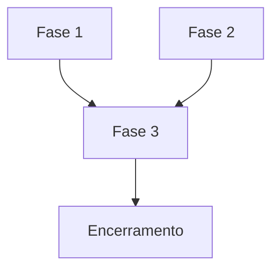
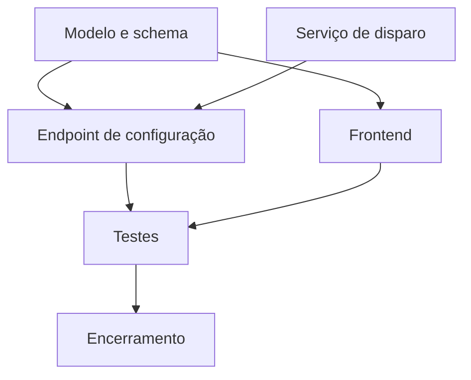
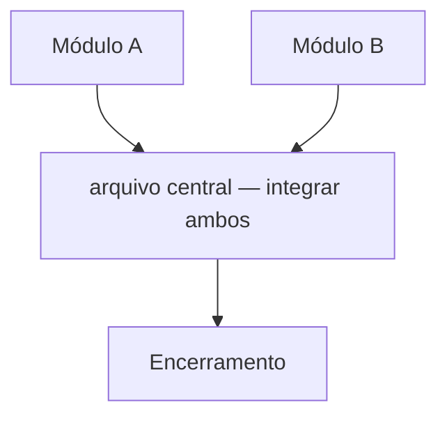

# Guia de Estrutura `.cursor/` — Boas Práticas para Projetos com IA

> **Para que serve:** Referência completa para montar e evoluir a pasta `.cursor/` em projetos reais.
> **Função:** Explicar filosofia, rules, hooks, MCP, agents, plans e checklist de maturidade — agnóstico a stack.

> Referência para replicar uma estrutura Cursor madura em qualquer projeto. Cobre filosofia, componentes, regras de autoria e anti-padrões. Agnóstico a stack e domínio.

---

## Índice

1. [Filosofia e Objetivos](#1-filosofia-e-objetivos)
2. [Estrutura de Diretórios](#2-estrutura-de-diretórios)
3. [Hooks — Automação de Qualidade](#3-hooks--automação-de-qualidade)
4. [Rules MDC — Contexto Sempre Presente](#4-rules-mdc--contexto-sempre-presente)
5. [Skills — Conhecimento Sob Demanda](#5-skills--conhecimento-sob-demanda)
6. [MCP — Ferramentas Externas para o Agente](#6-mcp--ferramentas-externas-para-o-agente)
7. [.cursorignore e Gestão de Contexto](#7-cursorignore-e-gestão-de-contexto)
8. [Notepads — Contexto Persistente Reutilizável](#8-notepads--contexto-persistente-reutilizável)
9. [Background Agents — Tarefas Assíncronas](#9-background-agents--tarefas-assíncronas)
10. [Commands — Fluxos Repetíveis como Slash Commands](#10-commands--fluxos-repetíveis-como-slash-commands)
11. [Agents — Especialistas por Domínio](#11-agents--especialistas-por-domínio)
12. [Plans — Execução Multiagente Estruturada](#12-plans--execução-multiagente-estruturada)
13. [Documentação de Orientação](#13-documentação-de-orientação)
14. [Seleção de Modelos](#14-seleção-de-modelos)
15. [Paralelismo Seguro](#15-paralelismo-seguro)
16. [Knowledge Graph](#16-knowledge-graph)
17. [Melhoria Iterativa da Estrutura](#17-melhoria-iterativa-da-estrutura)
18. [Roteiro de Implantação](#18-roteiro-de-implantação)
19. [Anti-padrões Globais](#19-anti-padrões-globais)
20. [Checklist de Maturidade](#20-checklist-de-maturidade)

---

## 1. Filosofia e Objetivos

A estrutura `.cursor/` não é documentação passiva — é **infraestrutura de governança de IA**. Ela define como o modelo deve pensar, agir e se auto-restringir durante o desenvolvimento.

### 1.1 Os Três Pilares

**Contexto certo, na hora certa.** O Cursor injeta contexto nas janelas de conversa. Contexto irrelevante consome tokens e confunde o modelo; contexto ausente gera código genérico que ignora as convenções do projeto. A arquitetura em camadas resolve isso:

| Camada | Mecanismo | Quando é carregado |
|--------|-----------|-------------------|
| Sempre presente | Rules com `alwaysApply: true` | Em toda conversa |
| Por arquivo | Rules com globs MDC | Quando o arquivo aberto faz match |
| Solicitado pelo agente | Rules com `description` rica | Agent decide se invoca |
| Sob demanda | Commands, Agents, Notepads, Skills | Quando o usuário invoca via `@` ou `/` |
| Ferramentas externas | MCP servers | Quando o agente precisa de dados externos |
| Pré-execução | Hooks | Antes de commits ou início de sessão |

**Redução de entropia operacional.** Sem estrutura, cada desenvolvedor usa o modelo de forma diferente. Com estrutura: todo commit segue Conventional Commits, todo código novo respeita os padrões do projeto, toda tarefa complexa tem plano de execução.

**Economia de tokens.** Rules com `alwaysApply: true` custam tokens em toda conversa. Regra de ouro: **rules curtas e focadas**; detalhes longos em Skills (invocadas sob demanda).

### 1.2 O que a Estrutura Não É

- Não é documentação para humanos lerem — é instrução para o modelo seguir.
- Não substitui revisão de código humana — amplifica a qualidade dela.
- Não é engessamento do processo — é um contrato sobre o que é não-negociável.

---

## 2. Estrutura de Diretórios

```
.cursor/
├── .cursorignore                # Arquivos excluídos do contexto da IA
├── mcp.json                     # Configuração de servidores MCP
├── hooks.json                   # Registro de hooks (eventos e scripts)
├── hooks/                       # Scripts dos hooks
│   ├── check-commit-msg.py      # Valida Conventional Commits
│   ├── check-<linter>.py        # Bloqueia commit se linter falhar
│   └── <acao>-on-session.py     # Tarefa automática ao iniciar sessão
│
├── rules/                       # Rules MDC — contexto injetado automaticamente
│   ├── core-rules/
│   │   └── agent-behavior-always.mdc   # Comportamento global obrigatório
│   ├── global-rules/
│   │   └── token-economy-always.mdc    # Economia de tokens
│   ├── <domínio>-rules/
│   │   └── <stack>-patterns-auto.mdc   # Padrões por tecnologia (com globs)
│   └── tool-rules/
│       ├── git-workflow-agent.mdc       # Fluxo Git
│       └── plan-architect-agent.mdc     # Estrutura de planos
│
├── skills/                      # Conhecimento especializado sob demanda
│   ├── <domínio>/
│   │   └── SKILL.md             # Instrução detalhada invocada dinamicamente
│   └── ...
│
├── commands/                    # Slash commands do projeto
│   ├── review.md
│   ├── security-check.md
│   ├── plano-otimizado.md
│   ├── multiagent.md
│   ├── pr.md
│   └── <outros fluxos recorrentes>.md
│
├── agents/                      # Agentes especializados
│   ├── security-audit.md
│   ├── new-<entidade>-feature.md
│   └── setup-environment.md
│
├── plans/                       # Planos de execução multiagente
│   ├── archive/
│   │   └── README.md
│   └── <slug>_<hash>.plan.md
│
├── MODEL_SELECTION_GUIDE.md     # Política de seleção de modelo por tarefa
└── PARALLEL_AGENTS.md           # Protocolo de paralelismo seguro
```

### Convenções de Nomenclatura

| Artefato | Padrão |
|----------|--------|
| Rules `alwaysApply` | `<domínio>-<descrição>-always.mdc` |
| Rules por glob | `<domínio>-<descrição>-auto.mdc` |
| Rules solicitadas pelo agente | `<domínio>-<descrição>-agent.mdc` |
| Commands | `kebab-case` descritivo do fluxo |
| Agents | `kebab-case` do papel especializado |
| Skills | `<domínio>/SKILL.md` |
| Plans ativos | `<slug>_<hash-8chars>.plan.md` |
| Hooks | `check-<o-que-valida>.py` ou `<ação>-on-<evento>.py` |

---

## 3. Hooks — Automação de Qualidade

Hooks executam **antes** ou **durante** eventos do Cursor. São a linha de defesa que garante qualidade mesmo quando o desenvolvedor esquece de rodar verificações manualmente.

### 3.1 Estrutura do `hooks.json`

```json
{
  "hooks": [
    {
      "name": "check-commit-msg",
      "event": "beforeShellExecution",
      "script": ".cursor/hooks/check-commit-msg.py",
      "failClosed": false,
      "description": "Valida mensagens de commit (Conventional Commits)"
    },
    {
      "name": "check-linter",
      "event": "beforeShellExecution",
      "script": ".cursor/hooks/check-linter.py",
      "failClosed": true,
      "description": "Bloqueia commit se o linter falhar"
    },
    {
      "name": "update-graph-on-session",
      "event": "sessionStart",
      "script": ".cursor/hooks/update-graph-on-session.py",
      "description": "Atualiza knowledge graph em background"
    }
  ]
}
```

**`failClosed: true`** = nega a operação se o hook falhar. Use para qualidade obrigatória.
**`failClosed: false`** = apenas avisa, não bloqueia. Use para orientação educativa.

### 3.2 Hook de Conventional Commits

```python
# .cursor/hooks/check-commit-msg.py
import re, json, sys

PATTERN = re.compile(
    r'^(feat|fix|chore|docs|refactor|test|style|perf|ci|build|revert)'
    r'(\(.+\))?!?:\s.+'
)

def check(payload: dict) -> dict:
    cmd = payload.get("command", "")
    if "git commit" not in cmd:
        return {"allow": True}

    msg = extract_commit_message(cmd)  # extrair -m "..." do comando
    if not msg:
        return {"allow": True}

    if not PATTERN.match(msg):
        return {
            "allow": False,
            "message": (
                "Mensagem de commit inválida.\n"
                "Formato: tipo(escopo)?: descrição\n"
                "Tipos válidos: feat|fix|chore|docs|refactor|test|style|perf|ci|build|revert\n"
                f"Recebido: '{msg}'"
            )
        }
    return {"allow": True}
```

**Por que isso importa:** Conventional Commits habilitam changelogs automáticos, semver e filtragem por tipo em `git log`. Sem enforcement, as mensagens degradam para "fix bug" e "wip" em semanas.

### 3.3 Hook de Linter

```python
# .cursor/hooks/check-linter.py
import subprocess, json

def check(payload: dict) -> dict:
    if "git commit" not in payload.get("command", ""):
        return {"allow": True}

    # Substituir pelo linter do projeto:
    # Python: ["python", "-m", "black", "--check", "src/"]
    # JS/TS:  ["npm", "run", "lint"]
    # Go:     ["golangci-lint", "run"]
    result = subprocess.run(
        ["<comando-do-linter>"],
        capture_output=True, text=True
    )

    if result.returncode != 0:
        return {
            "allow": False,
            "message": (
                "Linter falhou. Corrija antes de commitar:\n"
                f"  {result.stdout or result.stderr}\n"
                "  Rode: <comando para corrigir automaticamente>"
            )
        }
    return {"allow": True}
```

### 3.4 Hook de Sessão com Throttle

```python
# .cursor/hooks/update-graph-on-session.py
import os, time, subprocess, threading

INTERVAL_SECONDS = int(os.getenv("GRAPH_SESSION_INTERVAL", "14400"))  # 4h padrão
TS_FILE = ".cursor/.graph_session_ts"

def should_update() -> bool:
    if os.getenv("GRAPH_SESSION_HOOK") == "off":
        return False
    if not os.path.exists(TS_FILE):
        return True
    last = float(open(TS_FILE).read().strip())
    return (time.time() - last) > INTERVAL_SECONDS

def update():
    if not should_update():
        return
    subprocess.Popen(
        ["<comando-de-atualização>"],
        stdout=subprocess.DEVNULL, stderr=subprocess.DEVNULL
    )
    with open(TS_FILE, "w") as f:
        f.write(str(time.time()))

threading.Thread(target=update, daemon=True).start()
```

**Throttle é obrigatório.** Hooks de sessão sem throttle disparam a cada nova janela de chat. Com projetos grandes, isso é desperdício de CPU e tempo. Controle via variável de ambiente permite ajuste por desenvolvedor sem alterar o hook.

### 3.5 Boas Práticas para Hooks

| Regra | Motivo |
|-------|--------|
| Completar em < 10s | Bloquear o modelo por mais tempo quebra o fluxo |
| `failClosed: true` apenas para qualidade crítica e acordada pelo time | Reserve para bloqueios consensuais |
| Sempre fornecer instrução de desbloqueio | Um hook sem "como corrigir" é um obstáculo, não orientação |
| Não fazer chamadas de rede síncronas | Latência de rede é imprevisível |
| Throttle em hooks de sessão | Evita re-execução desnecessária |
| Testar hooks manualmente antes de ativar | `python .cursor/hooks/meu-hook.py '{"command": "git commit -m test"}'` |

---

## 4. Rules MDC — Contexto Sempre Presente

Rules MDC são o mecanismo mais importante da estrutura. Injetam contexto nas conversas automaticamente, sem que o desenvolvedor precise lembrar de incluir.

### 4.1 Os Quatro Modos de Ativação

O Cursor suporta quatro formas de ativar uma rule — escolher o modo certo é crítico para a economia de tokens:

| Modo | Configuração | Quando usar |
|------|-------------|-------------|
| **Always Apply** | `alwaysApply: true` | Regras comportamentais globais. Máx ~60 linhas. |
| **Auto Attach (glob)** | `globs: ["src/**/*.ts"]` | Padrões de código por tecnologia. Ativa quando o arquivo está aberto. |
| **Agent Requested** | Sem glob, sem alwaysApply | O agente lê a `description` e decide invocar. Bom para regras contextuais longas. |
| **Manual** | Sem glob, sem alwaysApply | Usuário menciona explicitamente `@nome-da-rule`. Útil para referência ocasional. |

**Regra de ouro:** `alwaysApply: true` deve ser reservado para regras que se aplicam a **toda** tarefa. Para o restante, prefira globs ou Agent Requested — mantêm o context window limpo.

### 4.2 Anatomia de um Arquivo MDC

```markdown
---
description: Descrição clara — o agente usa isso para decidir se a rule é relevante
globs:
  - "src/**/*.ts"
alwaysApply: false
---

# Título da Rule

Conteúdo...
```

A `description` é mais importante do que parece: no modo **Agent Requested**, ela é o que o modelo lê para decidir se deve carregar a rule. Escreva como se fosse responder "quando você deve usar esta rule?"

### 4.3 Rule Global de Comportamento

Esta rule deve ter no máximo **60 linhas** — é carregada em toda conversa.

```markdown
---
description: Comportamento base obrigatório em todas as conversas
alwaysApply: true
---

# Comportamento do Agente

## Idioma
- Comunicação com o usuário: [idioma do time]
- Código, docstrings, commits: [idioma definido pelo time]

## Segurança
- NUNCA hardcode credenciais, tokens, chaves ou senhas
- Sempre usar variáveis de ambiente — nunca valores literais em código
- NUNCA commitar arquivos de configuração com secrets reais

## Escopo de Edição
- Leia o arquivo antes de editar
- Não amplie escopo além do solicitado
- Para tarefas com 5+ arquivos: crie plano em `.cursor/plans/`

## Padrões Existentes
- Reutilize patterns do projeto antes de criar novos
- Não reinvente o que já existe no codebase

## Git
- Escopo: apenas o workspace atual
- Mensagens: Conventional Commits obrigatório
- Branches: `feature/<nome>` ou `fix/<nome>`
```

### 4.4 Rule de Economia de Tokens

```markdown
---
description: Instrui o modelo a ser seletivo com contexto para reduzir custo
alwaysApply: true
---

# Economia de Tokens

- Não anexe arquivos em massa sem necessidade; prefira busca direcionada
- Rules `alwaysApply` devem ser curtas; detalhes longos vão em Skills
- Uma conversa por objetivo principal — reduz ruído e perda de contexto
- Desative MCPs não usados na tarefa atual
```

### 4.5 Few-Shot Examples em Rules

Few-shot é uma das técnicas de maior impacto em rules: em vez de apenas descrever o padrão em texto, mostrar 2-3 exemplos concretos do output esperado. O modelo aprende por osmose e produz resultados muito mais aderentes.

```markdown
---
description: Padrões de endpoint da nossa API — ativar ao editar routers
globs:
  - "src/routes/**/*.ts"
alwaysApply: false
---

# Padrões de Endpoint

Todo endpoint deve seguir esta estrutura. Use os exemplos como referência direta.

## Exemplo 1 — GET com paginação

```typescript
// ✅ Correto
export const listItems = async (req: Request, res: Response) => {
  const { page = 1, limit = 20 } = req.query;
  const items = await ItemService.list({ page: Number(page), limit: Number(limit) });
  res.json({ success: true, data: items, meta: { page, limit } });
};
```

## Exemplo 2 — POST com validação e tratamento de erro

```typescript
// ✅ Correto
export const createItem = async (req: Request, res: Response) => {
  const validation = ItemSchema.safeParse(req.body);
  if (!validation.success) {
    return res.status(400).json({ success: false, errors: validation.error.issues });
  }
  const item = await ItemService.create(validation.data);
  res.status(201).json({ success: true, data: item });
};
```

## Anti-Padrões
- ❌ `res.json(data)` sem wrapper `{ success, data }`
- ❌ `req.body` sem validação de schema
- ❌ `console.error` solto — usar o logger do projeto
```

**Quando few-shot tem maior impacto:**
- Padrões de código que o modelo tende a "adivinhar" errado
- Estruturas de resposta de API com formato fixo
- Padrões de tratamento de erro específicos do projeto
- Qualquer convenção que diverge do que o modelo aprendeu no pré-treino

### 4.6 Rules por Glob — Padrão de Autoria

```markdown
---
description: Padrões <Tecnologia> obrigatórios no projeto
globs:
  - "<caminho dos arquivos da tecnologia>"
alwaysApply: false
---

# Padrões <Tecnologia>

## <Aspecto 1>
[Regra com exemplo mínimo — few-shot quando possível]

## <Aspecto 2>
[Regra com exemplo mínimo]

## Anti-Padrões
- ❌ O que nunca fazer nesta tecnologia neste projeto
```

**Exemplos de globs por tecnologia:**

| Tecnologia | Glob sugerido |
|-----------|---------------|
| Python | `"src/**/*.py"`, `"app/**/*.py"` |
| TypeScript/JavaScript | `"src/**/*.ts"`, `"src/**/*.tsx"` |
| Testes Python | `"tests/**/*.py"` |
| Testes JS/TS | `"**/*.test.ts"`, `"**/*.spec.ts"` |
| Infrastructure as Code | `"infra/**/*.tf"`, `"k8s/**/*.yaml"` |
| Docker | `"**/Dockerfile"`, `"docker-compose*.yml"` |

### 4.7 Rule de Auditoria / Compliance

Para projetos com requisitos regulatórios, uma rule específica garante que o modelo nunca esqueça os campos obrigatórios ao editar lógica de negócio:

```markdown
---
description: Cobertura de auditoria/compliance em operações sensíveis — ativar em services e routes
globs:
  - "<globs dos arquivos com lógica de negócio>"
alwaysApply: false
---

# Cobertura de Auditoria

## Operações que Exigem Registro
[Liste quais operações devem ser auditadas no seu domínio]

## Campos Mínimos Obrigatórios
[Liste os campos que todo registro de auditoria deve ter]

## Regras Críticas
- Auditoria NUNCA pode bloquear a operação principal — sempre try/except local
- Logs nunca devem conter credenciais, hashes ou tokens
- Nova ação visível ao usuário → registrar no dicionário de labels do frontend

## Anti-Padrões
- ❌ Operação que altera estado sem registro de auditoria
- ❌ Registro sem identificação do ator
- ❌ Registro sem resultado (sucesso/falha)
- ❌ PII/dados sensíveis no payload de log
```

### 4.8 Migração do Formato Legacy (`.cursorrules`)

O formato antigo `.cursorrules` (arquivo único na raiz) ainda funciona em paralelo com o formato MDC. Se o projeto tem um `.cursorrules`:

1. **Não remover imediatamente** — verifique o comportamento atual antes de migrar.
2. **Migrar em seções:** extraia um bloco por vez para um `.mdc` separado, testando após cada extração.
3. **Vantagens do MDC:** globs por arquivo, modo Agent Requested, organização em pastas, `description` para seleção inteligente.
4. **Após validar o MDC:** remover o `.cursorrules` para evitar conflito e duplicidade de contexto.

### 4.9 Tabela de Rules Recomendadas

| Rule | Trigger | Propósito |
|------|---------|-----------|
| `agent-behavior-always.mdc` | alwaysApply | Comportamento base global |
| `token-economy-always.mdc` | alwaysApply | Economia de tokens |
| `<stack>-patterns-auto.mdc` | glob por tecnologia | Padrões da linguagem/framework |
| `testing-patterns-auto.mdc` | glob de testes | Padrões de teste |
| `docker-ops-agent.mdc` | Agent Requested | Operações Docker/infra |
| `git-workflow-agent.mdc` | Agent Requested | Fluxo Git e PRs |
| `plan-architect-agent.mdc` | `.cursor/plans/**` | Estrutura de planos |
| `audit-coverage-auto.mdc` | glob de lógica de negócio | Requisitos regulatórios |

---

## 5. Skills — Conhecimento Sob Demanda

Skills são pacotes de conhecimento especializado invocados dinamicamente pelo agente — diferente de rules (sempre presentes ou por glob), skills só consomem tokens quando são relevantes para a tarefa em curso.

### 5.1 Skills vs Rules — Quando Usar Cada Um

| Critério | Rule | Skill |
|----------|------|-------|
| Frequência de uso | Alta (toda conversa ou todo arquivo) | Baixa (tarefas específicas) |
| Tamanho do conteúdo | Curto (< 60 linhas) | Qualquer tamanho |
| Ativação | Automática (glob ou alwaysApply) | Sob demanda pelo agente ou usuário |
| Conteúdo típico | Padrões de código, anti-padrões | Checklists longos, tutoriais, fluxos complexos |
| Impacto em tokens | Alto (sempre carregado) | Baixo (carregado quando necessário) |

**Regra prática:** se o conteúdo tem mais de 80 linhas e não é relevante em toda conversa → Skill.

### 5.2 Estrutura de uma Skill

```
.cursor/skills/
├── security-audit/
│   └── SKILL.md
├── create-feature/
│   └── SKILL.md
└── compliance-check/
    └── SKILL.md
```

```markdown
<!-- .cursor/skills/security-audit/SKILL.md -->

# Skill: Security Audit

## Quando esta skill é relevante
- Antes de releases
- Quando o usuário pede "auditoria de segurança"
- Após adicionar novo endpoint ou integração externa

## Checklist Completo

### Autenticação e Autorização
- [ ] Todo endpoint sensível tem proteção de autenticação
- [ ] Verificação de role/permissão aplicada corretamente
- [ ] Tokens expiram com TTL adequado
- [ ] Refresh token rotaciona após uso

### Validação de Inputs
- [ ] Inputs externos validados com schema (não ad-hoc)
- [ ] Tamanho máximo definido para campos de texto e uploads
- [ ] Tipos de arquivo validados no servidor, não apenas no cliente
- [ ] Risco de injection avaliado (SQL, NoSQL, OS, template)

### Dados e Privacidade
- [ ] PII e dados sensíveis ausentes em logs
- [ ] Respostas de API não expõem mais campos do que o necessário
- [ ] Tokens/sessões em armazenamento seguro (não localStorage)

### Infraestrutura
- [ ] Serviços internos não expostos publicamente
- [ ] Dependências com versão fixada
- [ ] Imagens sem tag `:latest`

## Como Reportar
Para cada achado: `[SEVERIDADE] arquivo:linha — descrição — recomendação`
Severidades: CRÍTICO / ALTO / MÉDIO / BAIXO / INFO
```

### 5.3 Invocando Skills

Skills podem ser invocadas de três formas:

1. **Pelo agente automaticamente** — o agente lê a `description` da skill e decide se é relevante.
2. **Pelo usuário via @mention** — `@security-audit` no chat.
3. **Por um command ou agent** — um command pode referenciar explicitamente uma skill.

### 5.4 Boas Práticas para Skills

| Regra | Motivo |
|-------|--------|
| Uma skill por domínio de conhecimento | Skills genéricas não ajudam — específicas sim |
| Incluir "quando esta skill é relevante" | Ajuda o agente a decidir quando invocar |
| Checklists acionáveis, não texto corrido | O modelo executa melhor com itens discretos |
| Referenciar skills em agents em vez de duplicar | Evita divergência de conteúdo |
| Máximo 2-3 skills carregadas simultaneamente | Muitas skills = mesmo problema que muitas rules |

---

## 6. MCP — Ferramentas Externas para o Agente

O Model Context Protocol (MCP) é um padrão aberto que permite ao agente do Cursor interagir com sistemas externos — bancos de dados, APIs, ferramentas de gestão de projeto — de forma padronizada e segura.

### 6.1 O que é e por que importa

Sem MCP, o agente só consegue ler arquivos e executar comandos de shell. Com MCP, o agente pode:
- Consultar um banco de dados diretamente
- Buscar issues e PRs no GitHub/Jira/Linear
- Ler e escrever em Notion/Confluence
- Invocar APIs internas sem expor credenciais no chat

### 6.2 Configuração — `mcp.json`

O arquivo `.cursor/mcp.json` configura servidores MCP no escopo do projeto. Credenciais via variáveis de ambiente, nunca hardcoded. Documente tokens em `.cursor/mcp.env.example` (não commitar valores reais).

#### GitHub (servidor oficial — recomendado)

O pacote npm `@modelcontextprotocol/server-github` foi **descontinuado em abril/2025**. Use o servidor oficial [`github/github-mcp-server`](https://github.com/github/github-mcp-server).

**Local via Docker** (configuração deste repositório em `.cursor/mcp.json`):

```json
{
  "mcpServers": {
    "github": {
      "command": "docker",
      "args": [
        "run",
        "-i",
        "--rm",
        "--env-file",
        "${workspaceFolder}/.cursor/mcp.env",
        "ghcr.io/github/github-mcp-server"
      ]
    }
  }
}
```

Requisitos: Docker Desktop em execução; arquivo **`.cursor/mcp.env`** (copiar de `.cursor/mcp.env.example`) com `GITHUB_PERSONAL_ACCESS_TOKEN` — PAT com escopo `repo` (`read:org` se necessário). O arquivo está no `.gitignore`; **nunca commitar**. O Cursor não permite secrets na UI com nome `GITHUB_*`; por isso o token fica no `envFile` local. Após criar ou alterar `mcp.env`, reinicie o Cursor e valide o indicador verde em **Settings → Tools & Integrations → MCP**.

**Remoto via HTTP** (alternativa sem Docker; Cursor v0.48+):

```json
{
  "mcpServers": {
    "github": {
      "url": "https://api.githubcopilot.com/mcp/",
      "headers": {
        "Authorization": "Bearer ${env:GITHUB_PERSONAL_ACCESS_TOKEN}"
      }
    }
  }
}
```

Guia oficial de instalação no Cursor: [install-cursor.md](https://github.com/github/github-mcp-server/blob/main/docs/installation-guides/install-cursor.md).

#### Outros servidores (exemplos)

```json
{
  "mcpServers": {
    "postgres": {
      "command": "node",
      "args": ["./scripts/mcp-pg-server.js"],
      "env": {
        "DATABASE_URL": "${DATABASE_URL}"
      }
    },
    "linear": {
      "command": "npx",
      "args": ["-y", "@linear/mcp-server"],
      "env": {
        "LINEAR_API_KEY": "${LINEAR_API_KEY}"
      }
    }
  }
}
```

**Escopo de configuração:**

| Arquivo | Escopo | Quando usar |
|---------|--------|-------------|
| `.cursor/mcp.json` | Projeto | Ferramentas específicas do projeto |
| `~/.cursor/mcp.json` | Global (usuário) | Ferramentas usadas em todos os projetos |

### 6.3 Casos de Uso por Categoria

**Gestão de Código:**
- GitHub MCP: consultar PRs, issues, branches sem sair do chat
- GitLab MCP: pipeline status, merge requests

**Gestão de Projeto:**
- Linear MCP: criar/atualizar issues, buscar contexto de tickets
- Jira MCP: sincronizar tasks com código

**Dados e Infraestrutura:**
- PostgreSQL/MySQL MCP: consultar esquema e dados de desenvolvimento
- Redis MCP: inspecionar cache
- Filesystem MCP: acesso estruturado a diretórios específicos

**Documentação:**
- Notion MCP: ler/escrever documentação de produto
- Confluence MCP: atualizar wikis técnicas

### 6.4 Boas Práticas para MCP

| Regra | Motivo |
|-------|--------|
| Credenciais sempre via variável de ambiente | Nunca hardcode em `mcp.json` |
| Desativar servidores não usados na tarefa atual | Reduz superfície de ataque e consumo de tokens |
| MCP de banco: apenas ambiente de desenvolvimento | Nunca apontar para produção |
| Revisar permissões de cada servidor MCP | Princípio do menor privilégio |
| Adicionar servidores MCP ao `.cursorignore` se contiverem dados sensíveis | Evitar que o agente exponha dados acidentalmente |

---

## 7. `.cursorignore` e Gestão de Contexto

### 7.1 `.cursorignore`

Análogo ao `.gitignore`, mas para o Cursor. Arquivos listados são excluídos de:
- Acesso do agente (leitura de arquivos)
- Indexação para busca semântica (`@codebase`)
- Autocompletion baseada no conteúdo

```gitignore
# .cursorignore

# Credenciais e configuração sensível
.env
.env.*
!.env.example
secrets/
*.pem
*.key

# Builds e artefatos (reduzem qualidade do índice)
dist/
build/
.next/
__pycache__/
*.pyc
coverage/

# Dependências (geralmente irrelevante para o agente)
node_modules/
.venv/
vendor/

# Dados grandes ou binários
*.sql
*.csv
*.parquet
*.sqlite
assets/videos/
```

**Importante:** `.cursorignore` é **best-effort** — não é garantia de segurança absoluta. Para dados muito sensíveis, adicione camadas de controle adicionais. Se `.gitignore` já existe, o Cursor o respeita automaticamente; use `.cursorignore` para exclusões adicionais específicas do contexto de IA.

### 7.2 O Sistema de @mentions — Contexto Cirúrgico

Em vez de incluir arquivos em massa, o sistema de `@mentions` permite injetar contexto preciso. Isso reduz "context pollution" — incluir 20 arquivos quando apenas 3 são relevantes dilui a atenção do modelo.

| Mention | O que faz | Quando usar |
|---------|-----------|-------------|
| `@file` | Referencia arquivo específico | Quando sabe exatamente qual arquivo é relevante |
| `@folder` | Referencia pasta inteira | Para contexto de um módulo completo |
| `@codebase` | Busca semântica em todo o projeto | Quando não sabe exatamente onde está o código |
| `@docs` | Documentação oficial de bibliotecas indexadas | Para aprender APIs de libs sem sair do chat |
| `@web` | Busca web ao vivo | Informações atualizadas (CVEs, changelogs, Stack Overflow) |
| `@git` | Histórico de commits e diffs | Gerar mensagens de commit, entender mudanças recentes |
| `@notepad` | Contexto de um Notepad específico | Reutilizar blocos de contexto salvos |

**`@codebase` é o mention mais poderoso.** Ele ativa busca semântica que recupera automaticamente os arquivos mais relevantes para a pergunta. Exemplo: `@codebase Como está implementada a autenticação?` retorna os arquivos de auth sem precisar listá-los manualmente.

**Boas práticas de @mentions:**

| Situação | Abordagem recomendada |
|----------|-----------------------|
| Sabe o arquivo exato | `@file caminho/arquivo.ts` |
| Sabe o módulo, não o arquivo | `@folder src/auth/` |
| Pergunta arquitetural | `@codebase` + pergunta |
| Precisa de doc de biblioteca | `@docs react-query` |
| Bug com stacktrace externo | `@web` + stacktrace |
| Gerando mensagem de commit | `@git` |

---

## 8. Notepads — Contexto Persistente Reutilizável

Notepads são blocos de contexto nomeados que persistem entre sessões e podem ser injetados em qualquer chat ou composer via `@NomeDoNotepad`.

### 8.1 Diferença entre Notepads, Rules e Skills

| Aspecto | Notepad | Rule | Skill |
|---------|---------|------|-------|
| Ativação | Manual (`@`) | Automática ou Agent Requested | Sob demanda |
| Persistência | Entre sessões | Sempre (versionado em git) | Sempre (versionado em git) |
| Editável pelo agente | Não | Não | Não |
| Caso de uso típico | Contexto de projeto em andamento, decisões arquiteturais recentes | Padrões de código estáveis | Checklists e fluxos complexos |

### 8.2 Casos de Uso Práticos

```
@Auth_Guidelines      — Regras de autenticação que o time está revisando
@Sprint_Context       — Contexto do sprint atual (objetivos, decisões tomadas)
@API_Contract_v2      — Contrato da nova API antes de estar no código
@Migration_Plan       — Plano de migração em andamento
@Oncall_Runbook       — Passos de diagnóstico para o time de plantão
```

### 8.3 Boas Práticas para Notepads

| Regra | Motivo |
|-------|--------|
| Nomes descritivos e específicos | Facilita descoberta via `@` |
| Conteúdo que muda com o projeto | Conteúdo estável vai em rules ou skills |
| Não colocar credenciais | Notepads não têm controle de acesso granular |
| Arquivar quando o contexto vence | Notepads obsoletos poluem o contexto |
| Mencionar apenas quando relevante | `@Notepad` em toda mensagem = mesma armadilha de `alwaysApply` |

---

## 9. Background Agents — Tarefas Assíncronas

Background Agents são agentes remotos que rodam em VMs cloud de forma assíncrona — clonam o repositório, executam a tarefa em branch separada e abrem um PR.

### 9.1 Quando Usar

| Usar para | Não usar para |
|-----------|---------------|
| Tarefas com escopo claro e critério mensurável (testes passam, lint verde) | Tarefas que requerem feedback mid-execution |
| Refactorings sistemáticos em múltiplos arquivos | Decisões de design durante a execução |
| Geração de testes de cobertura | Quando o critério de sucesso é subjetivo |
| Trabalho paralelo a outras tarefas locais | Tarefas com dependências externas não disponíveis na VM |

### 9.2 Fluxo de Funcionamento

```
1. Descrever tarefa com critério mensurável ("adicionar testes até 80% de cobertura")
2. Agent clona o repo em VM Ubuntu isolada
3. Cria branch `agent/<task-slug>`
4. Executa terminal, instala dependências, roda testes
5. Abre PR com sumário de mudanças
6. Revisar o PR como qualquer outro código
```

### 9.3 Como Estruturar a Instrução

Background Agents têm mais sucesso quando a instrução inclui:

```markdown
## Tarefa para Background Agent

**Objetivo:** [O que deve ser feito — específico]
**Critério de conclusão:** [Como saber que está pronto — mensurável]
**Arquivos de referência:** [Padrões existentes para seguir]
**O que NÃO fazer:** [Escopo negativo explícito]
**Validação:** [Comando que deve passar antes de abrir PR]
```

**Exemplo:**
```markdown
Adicione testes unitários para todos os services em `src/services/`.
Critério: cobertura >= 80% em cada service individual.
Padrão: seguir os testes existentes em `src/services/user.test.ts`.
Não modificar o código dos services — apenas criar/completar os arquivos `.test.ts`.
Validação: `npm test -- --coverage` deve passar sem falhas.
```

---

## 10. Commands — Fluxos Repetíveis como Slash Commands

Commands são instruções em Markdown executadas quando o usuário digita `/nome-do-comando`. Servem para fluxos repetitivos com múltiplos passos, validações e decisões.

### 10.1 Anatomia de um Command

```markdown
# /nome-do-comando

Descrição de uma linha do que o comando faz.

## Pré-requisitos
- O que deve existir antes de executar

## Fluxo

1. **Passo 1** — o que fazer, como verificar
2. **Passo 2** — próxima ação
3. **Passo 3** — validação

## Regras
- O que NUNCA fazer neste fluxo

## Saída Esperada
- O que o usuário vê ao final
```

### 10.2 Command de Review

```markdown
# /review

Revisa mudanças não commitadas aplicando as verificações de qualidade do projeto.

## Fluxo

### Linters e Formatação
1. Executar linter(s) configurados no projeto
2. Verificar formatação de código
3. Verificar imports/dependências não utilizadas

### Segurança
1. Credenciais hardcoded no diff?
2. Inputs externos validados antes de usar?
3. Endpoints/rotas protegidos com autenticação?
4. Arquivos de configuração sensíveis staged?

### Consistência
1. Novos tipos/schemas alinhados com os existentes?
2. Padrões de naming seguidos?
3. Testes cobrindo os casos novos?

## Saída
- Sumário por categoria: ✅ OK / ⚠️ Atenção / ❌ Crítico
- Não corrigir automaticamente — exibir e aguardar aprovação

## Regras
- Nunca modificar código sem aprovação explícita
- Se linter falhar: exibir output completo, não resumo
```

### 10.3 Command de Security Check

```markdown
# /security-check

Auditoria rápida de segurança no diff atual.

## Verificações

### Credenciais Hardcoded
Buscar padrões como:
- Strings que parecem senhas, tokens, chaves de API com valores literais
- Variáveis de autenticação não lidas de variáveis de ambiente
- Arquivos `.env` ou de configuração staged

### Autenticação e Autorização
- Rotas que deveriam exigir autenticação estão protegidas?
- Verificação de permissão/role aplicada nos recursos corretos?
- Tokens/sessões armazenados de forma segura?

### Inputs e Outputs
- Inputs externos (usuário, API) validados antes de usar?
- Outputs sanitizados para evitar injection?
- Dados sensíveis (PII, credenciais) excluídos de logs?

### Dependências
- Pacotes novos têm versão fixada?
- Dependências críticas com vulnerabilidades conhecidas?

## Saída
Relatório por categoria: ✅ OK / ⚠️ Atenção / ❌ Crítico
```

### 10.4 Commands de Planejamento e Execução

```markdown
# /plano-otimizado

Gera um plano multiagente em `.cursor/plans/<slug>_<hash>.plan.md`.
Nunca começar a escrever o plano antes de completar o discovery.

## Fase 1 — Discovery (obrigatório antes de qualquer escrita)

Execute na ordem abaixo e registre os achados em memória de trabalho:

### 1a. Estado atual do repositório
- `git status` → há mudanças em andamento? Em qual branch?
- `git diff --stat` → quais arquivos já foram tocados?
- `git log --oneline -5` → qual foi a última entrega? Que padrão de commit o time usa?

### 1b. Escopo da tarefa
- O que o usuário pediu, palavra por palavra
- Qual é o objetivo de negócio por trás (não apenas o técnico)
- Existe ticket/issue referenciado? Ler se sim.

### 1c. Mapeamento de arquivos afetados
Para cada entidade/domínio na tarefa:
- Onde fica o modelo/schema? Existe um similar como padrão?
- Onde fica o serviço/lógica? Qual é o arquivo de referência?
- Onde fica o router/controller? Qual é o padrão de rota existente?
- Onde ficam os testes? Qual é o padrão de fixture?
- Onde fica o frontend equivalente (se aplicável)?

### 1d. Identificar arquivos críticos
Ler `PARALLEL_AGENTS.md`. Marcar os arquivos da tarefa que estão na lista
de críticos (ponto de entrada, config central, auth, orquestração).

### 1e. Identificar padrões reutilizáveis
Abrir 1-2 arquivos similares ao que será criado. Registrar:
- Estrutura de imports
- Padrão de naming
- Padrão de error handling
- Padrão de auditoria/log (se regulatório)

### 1f. Ambiguidades
Se após o discovery o escopo ainda não estiver claro: **parar e perguntar**.
Não inventar escopo. Uma pergunta bem feita aqui evita retrabalho depois.

---

## Fase 2 — Particionamento em Fases

Regras de particionamento:

**Uma fase = uma unidade entregável coesa.**
- Não misturar backend e frontend na mesma fase se puder ser paralelo
- Não misturar criação de model com criação de router (dependência!)
- Testes ficam na mesma fase que o código OU em fase própria (se complexos)

**Ordem natural de dependência:**
```
Models/Schemas → Services/Logic → Routers/Controllers → Tests → Frontend → Encerramento
```
Fases sem dependência entre si → candidatas a paralelo.
Fases que compartilham arquivo crítico → serializar.

**Limites:**
- Mínimo 2 fases (trivial não vira plano)
- Máximo 8 fases por plano (dividir em 2 planos se passar)
- Cada fase: máximo 25 linhas no .plan.md

---

## Fase 3 — Seleção de Modelos por Fase

Para cada fase, classificar a complexidade e atribuir o tier mínimo suficiente:

| Tipo de trabalho na fase | Tier |
|--------------------------|------|
| Criar arquivo seguindo padrão existente (1 arquivo) | econômico |
| Refactor mecânico em múltiplos arquivos | econômico |
| Lógica nova simples sem dependências complexas | econômico-médio |
| Integrar módulos com dependências cruzadas | médio |
| Decisão de design com 2+ opções não óbvias | médio com thinking |
| Segurança, auth, compliance | alto |

Ler `MODEL_SELECTION_GUIDE.md` para slugs canônicos atuais.

---

## Fase 4 — Escrita do Plano

Seguir estritamente a estrutura de `plan-architect-agent.mdc`.
Regras de escrita:
- Contexto: tabela, máx 40 linhas, apenas fatos descobertos (não suposições)
- Mermaid: IDs F1..FN, arestas apenas onde há dependência real
- Cada fase: objetivo + arquivos + mudanças comportamentais + checklist
- Mudanças: descrever O QUÊ muda de comportamento, não como implementar
  ✅ "Adicionar endpoint GET /items/ com paginação e autenticação JWT"
  ❌ "Criar função async def list_items(): return await db.find_all()"
- Encerramento: critério mensurável (comando que retorna 0, não "tudo ok")

## Saída
Salvar em `.cursor/plans/<slug>_<hash8>.plan.md` onde hash8 são os primeiros
8 caracteres de `git rev-parse HEAD`. Exibir resumo ao usuário: fases, batches
de paralelo, modelo parent sugerido.
```

---

```markdown
# /multiagent

Executa um plano `.plan.md` em batches de agentes paralelos.
Recebe como argumento o caminho do arquivo: `/multiagent @plano.md`

## Fase 1 — Parse e Validação do Plano

### 1a. Ler o plano
- Ler o frontmatter: extrair lista de todos os F-IDs e seus status
- Ler `## Diagrama de dependências`: extrair o grafo Mermaid
  Construir mentalmente: quais fases dependem de quais?
  Exemplo: `F1 --> F3` significa F3 só pode rodar após F1 completar.

### 1b. Construir batches de execução
Algoritmo:
1. Identificar fases sem nenhuma dependência pendente → Batch 1
2. Após Batch 1 completar: quais fases ficam desbloqueadas? → Batch 2
3. Repetir até esgotar todas as fases
4. Encerramento sempre fica no último batch sozinho

Exemplo para o grafo `F1→F3, F2→F3, F3→F4, F4→F5`:
- Batch 1: [F1, F2] → paralelo (sem dependências)
- Batch 2: [F3] → sequencial (depende de F1 e F2)
- Batch 3: [F4] → sequencial
- Batch 4: [F5 — Encerramento]

### 1c. Validar disjunção de arquivos (OBRIGATÓRIO antes de paralelizar)
Para cada batch com 2+ fases:
- Listar os arquivos de cada fase (seção "Arquivos" de cada fase)
- Verificar interseção: algum arquivo aparece em 2 fases do mesmo batch?
- Se sim: mover a fase conflitante para o próximo batch
- Verificar contra `PARALLEL_AGENTS.md`: algum arquivo é "crítico"?
  Se sim: aquela fase nunca pode estar em paralelo com qualquer outra.

---

## Fase 2 — Execução dos Batches

Para cada batch, executar as fases em paralelo via Task:

### Contexto que cada Task recebe
Cada agente de fase recebe APENAS:
1. A seção `## Contexto` do plano (tabela com referências e arquivos críticos)
2. A seção `## Convenções de execução` do plano
3. A seção `## Fase FN` específica dele (objetivo, arquivos, mudanças, checklist)
4. A instrução: "Ao terminar, criar `.cursor/plans/agent-FN-done.md` com
   sumário do que foi feito e qualquer divergência do plano."

**Não enviar o plano inteiro para cada Task** — apenas o contexto necessário.

### Durante a execução
- Aguardar todos os agentes do batch terminarem antes de iniciar o próximo
- Monitorar: se uma Task retornar erro ou não criar o arquivo `done`, pausar
  e reportar ao usuário antes de continuar

---

## Fase 3 — Consolidação Pós-Batch

Após cada batch (especialmente batches paralelos), verificar:

### 3a. Consistência entre fases paralelas
- Os arquivos criados por F1 e F2 (se paralelos) têm imports compatíveis?
- Há nomes de variável/tipo que divergem entre as fases?
- Alguma fase criou arquivo que o plano não previa?

### 3b. Integração em arquivos compartilhados
Se uma fase próxima precisa registrar algo em arquivo crítico
(ex: ponto de entrada, router principal):
- Fazer esta integração manualmente, não delegar a Task
- Verificar que o arquivo crítico não foi tocado por fase não autorizada

### 3c. Arquivos `done`
Ler cada `.cursor/plans/agent-FN-done.md`:
- A fase cumpriu o objetivo declarado?
- Houve divergência do plano? Se sim: o impacto afeta fases seguintes?
- Atualizar `todo.status` da fase para `completed`

---

## Fase 4 — Encerramento

Executar apenas após todos os batches anteriores consolidados:

1. Rodar o comando de validação do projeto (`## Encerramento` do plano)
2. Se falhar: identificar a fase responsável, corrigir, revalidar
3. Rodar lint separadamente se não incluso na validação
4. Confirmar: todos os `todo.status` = `completed`?
5. Remover arquivos `agent-FN-done.md` temporários
6. Reportar ao usuário: o que foi feito, o que passou, se há pendências

## Regras Absolutas
- Nunca paralelizar fases com arquivo em comum — sem exceções
- Nunca declarar sucesso antes da validação passar
- Nunca avançar batch com falha não resolvida no batch anterior
- Falha em Task: pausar e reportar ao usuário com contexto completo
```

### 10.5 Commands de Infraestrutura

Para cada operação de infraestrutura recorrente, criar um command dedicado:

```
/infra-up     → sobe o ambiente (verificar pré-requisitos, executar, monitorar)
/infra-down   → derruba (confirmar se há dados, oferecer opções)
/infra-logs   → coleta e analisa logs de todos os serviços
/infra-debug  → diagnóstico direcionado por categoria de erro
/infra-reset  → ⚠️ reset completo com confirmação explícita obrigatória
```

**Regra para operações destrutivas:** qualquer command que apaga dados persistentes deve:
1. Listar o que será destruído
2. Exibir alternativa mais segura
3. Pedir confirmação explícita ("s/N") antes de qualquer ação

### 10.6 Command de Pull Request

```markdown
# /pr

Cria pull request com commit, push e descrição gerada do diff.

## Fluxo
1. `git diff` — entender as mudanças
2. Se linter falhou: invocar `/review` antes de continuar
3. Montar mensagem de commit com prefixo correto
4. `git add` → `git commit` → `git push`
5. Criar PR: título curto (< 70 chars) + body com mudanças + checklist de testes

## Regras
- Nunca incluir arquivos de configuração sensíveis no commit
- Nunca forçar push sem confirmação explícita
- Nunca criar PR de `main` para `main`
```

### 10.7 Boas Práticas para Commands

| Regra | Motivo |
|-------|--------|
| Confirmar antes de operações destrutivas | Dados perdidos não voltam |
| Especificar saída esperada | O usuário sabe o que foi feito |
| Listar alternativas mais seguras | Evita escalada desnecessária |
| Incluir pré-requisitos | Falhas de pré-req têm mensagens melhores |
| Diagnóstico antes de correção | Entender o problema antes de agir |
| Não duplicar lógica de rules | Commands referenciam rules, não repetem |

---

## 11. Agents — Especialistas por Domínio

Agents são personas especializadas que o modelo assume para tarefas complexas. Diferente de commands (fluxo fixo), agents têm raciocínio próprio dentro de um escopo definido.

### 11.1 Anatomia de um Agent

```markdown
---
name: nome-do-agent
description: >
  Uma ou duas linhas descrevendo quando e por que usar este agent.
  Aparece na UI de seleção de agent. O modelo usa para decidir se é relevante.
readonly: false  # true = apenas lê, nunca modifica
---

# Agent: Nome

## Trigger
Quando o usuário pedir "[tipo de tarefa]", acionar este agent.

## Contexto
O que o agent precisa saber sobre o domínio para trabalhar bem...

## Execution Flow

### [FASE 1 — NOME]
O que fazer, o que verificar, o que produzir.

### [FASE 2 — NOME]
O que fazer, o que verificar, o que produzir.

## Constraints
- O que este agent NUNCA deve fazer
- Limites de escopo explícitos

## Final Checklist
- [ ] Itens de aceitação obrigatórios
```

### 11.2 Agent de Auditoria de Segurança (readonly)

```markdown
---
name: security-audit
description: >
  Auditoria readonly do projeto. Verifica autenticação, validação de inputs,
  credenciais hardcoded e configurações de infra. Use antes de releases.
readonly: true
---

# Agent: Security Audit

## Trigger
"Auditoria de segurança", "security review", "verificar vulnerabilidades".

## Fluxo

### [1 — AUTENTICAÇÃO E AUTORIZAÇÃO]
- Todo endpoint sensível tem proteção?
- Verificação de permissão no lugar correto (middleware, não ad-hoc)?
- Alguma rota sem proteção que deveria ter?

### [2 — VALIDAÇÃO DE INPUTS]
- Inputs externos validados com schema antes de usar?
- Risco de injection (SQL, NoSQL, OS command, template)?
- Uploads com validação de tipo e tamanho no servidor?

### [3 — CREDENCIAIS E CONFIGURAÇÃO]
- Strings literais que parecem credenciais?
- Variáveis de ambiente lidas corretamente?
- Arquivos de configuração sensíveis em `.gitignore`?

### [4 — DADOS E PRIVACIDADE]
- PII ou dados sensíveis em logs?
- Respostas de API expostas mais do que o necessário?
- Tokens/sessões em armazenamento seguro?

### [5 — INFRAESTRUTURA]
- Serviços internos expostos publicamente?
- Dependências com versão fixada?

## Saída
Gerar `docs/security-audit-<YYYY-MM-DD>.md` com achados por severidade.

## Constraints
- READONLY — nunca modifica código
- Achados "Crítico": reportar imediatamente ao usuário, não apenas no arquivo
```

### 11.3 Agent de Nova Feature

```markdown
---
name: new-feature
description: >
  Implementa feature completa do modelo/schema ao frontend, seguindo padrões do projeto.
  Use quando precisar adicionar CRUD ou fluxo novo para uma entidade.
---

# Agent: Nova Feature

## Execution Flow

### [PLAN]
Criar `.cursor/plans/<entidade>-feature.md` com escopo, dependências e critérios.

### [MODELO / SCHEMA]
- Entidade tipada com campos obrigatórios
- Schema de request e response (sem campos sensíveis no response)
- Validadores de domínio

### [LÓGICA DE NEGÓCIO]
- Service com operações da entidade
- Toda entrada externa validada antes de usar
- Auditoria em operações sensíveis (se aplicável ao projeto)

### [ENDPOINTS / API]
- Autenticação e autorização corretas
- Response model explícito
- Registrar a rota no ponto central do projeto

### [TESTES]
- Cobrir: 401, 403, 200/201
- Mockar serviços externos em CI
- Validar contratos de request/response

### [FRONTEND]
- Serviço de API alinhado com os endpoints
- Tipos alinhados com schemas de backend
- Listagem + formulário com validação client-side

### [VALIDATE]
- Linter sem erros
- Testes passando
- Validação completa do projeto

## Final Checklist
- [ ] Nenhuma credencial hardcoded
- [ ] Inputs externos validados
- [ ] Endpoints protegidos com autenticação
- [ ] Testes cobrem 401, 403 e sucesso
- [ ] Commits com Conventional Commits
- [ ] Arquivos de configuração fora do commit
```

### 11.4 Boas Práticas para Agents

| Regra | Motivo |
|-------|--------|
| `readonly: true` em agents de análise | Previne modificação acidental |
| `description` rica e específica | Usada para seleção automática — seja preciso |
| Trigger explícito | Deixa claro para o usuário quando usar |
| Execution flow com fases nomeadas | Facilita retomada se interrompido |
| Final checklist obrigatório | Garante que nada crítico seja esquecido |
| Constraints de segurança explícitas | O modelo respeita mais quando escrito formalmente |
| Um agent por domínio de responsabilidade | Escopo amplo = resultado genérico |
| Skills referenciadas em vez de duplicadas | Skills são reutilizáveis; conteúdo duplicado diverge |

---

## 12. Plans — Execução Multiagente Estruturada

Plans são a camada de coordenação para tarefas que envolvem muitos arquivos ou múltiplos domínios. A estrutura `.plan.md` define o que fazer, em que ordem, com qual modelo.

### 12.1 Estrutura Completa de um Plano

```markdown
---
name: "nome-do-plano"
overview: "Uma linha descrevendo o objetivo principal"
todos:
  - id: F1
    content: "Fase 1 — descrição"
    status: pending
  - id: F2
    content: "Fase 2 — descrição"
    status: pending
  - id: F3
    content: "Encerramento"
    status: pending
isProject: false
---

# Nome do Plano

## Contexto

| Item | Detalhe |
|------|---------|
| Branch | `feature/nome` |
| Objetivo | O que será construído |
| Referências | Arquivos/módulos existentes para usar como padrão |
| Arquivos críticos | Lista dos que nunca devem ser editados em paralelo |
| Validação final | Comando de validação do projeto |

## Diagrama de dependências



## Convenções de execução
- Idioma do código e comunicação
- Credenciais: variáveis de ambiente, nunca hardcoded
- Paralelo seguro: apenas quando arquivos forem disjuntos
- Validação: somente no Encerramento

## Modelos por fase

| Fase | Modelo |
|------|--------|
| F1 | [modelo econômico] |
| F2 | [modelo econômico] |
| F3 | [modelo médio para decisão de design] |
| F4 | [modelo econômico] |

---

## Fase F1 — [Nome]

**Modelo:** [slug]

**Objetivo:** O que esta fase entrega.

**Arquivos:**
- `caminho/arquivo.ext` (criar)
- `caminho/outro.ext` (modificar)

**Mudanças:**
- Descrição comportamental — sem snippets inline
- Ex: "Adicionar endpoint `GET /recurso/` com paginação e autenticação"

**Checklist:**
- [ ] Item de aceitação 1
- [ ] Item de aceitação 2

---

## Encerramento

**Modelo parent:** [modelo para orquestração]

**Critérios "verde":**
- [ ] Validação do projeto retorna código 0
- [ ] Lint sem erros
- [ ] Testes passam
- [ ] Nenhuma credencial no diff
- [ ] Todos os `todo.status` = `completed`
```

### 12.2 Ciclo de Vida de um Plano

```
1. /plano-otimizado    → cria .plan.md em .cursor/plans/
2. /multiagent @plano  → executa fases, atualiza todo.status
3. Validação verde     → encerramento confirmado
4. Mover para archive/ → histórico preservado
```

### 12.3 Exemplo Anotado — Plano Completo

O exemplo abaixo usa um cenário genérico ("sistema de notificações por webhook") para demonstrar cada decisão de um plano bem construído. As anotações em `<!-- -->` explicam o raciocínio — não fazem parte do arquivo real.

```markdown
---
name: "webhook-notification-system"
overview: "Adicionar sistema de notificações via webhook para eventos de criação e atualização de recursos"
todos:
  - id: F1
    content: "Backend — modelo e schema de Webhook"
    status: pending
  - id: F2
    content: "Backend — serviço de disparo e retry"
    status: pending
  - id: F3
    content: "Backend — endpoint de configuração"
    status: pending
  - id: F4
    content: "Frontend — página de configuração de webhooks"
    status: pending
  - id: F5
    content: "Testes de integração"
    status: pending
  - id: F6
    content: "Encerramento"
    status: pending
isProject: false
---

# Sistema de Notificações via Webhook

<!-- CONTEXTO: tabela com fatos concretos descobertos no discovery.
     Cada linha responde "de onde vem essa informação?".
     Sem suposições — apenas o que foi verificado. -->

## Contexto

| Item | Detalhe |
|------|---------|
| Branch | `feature/webhook-notifications` |
| Objetivo | Permitir que integrações externas recebam eventos em tempo real |
| Referência de model | `src/models/integration.py` — mesmo padrão Beanie |
| Referência de serviço | `src/services/email_service.py` — padrão de retry com backoff |
| Referência de router | `src/routers/integrations.py` — padrão de CRUD autenticado |
| Referência de frontend | `src/pages/IntegrationsPage.tsx` — mesmo layout de listagem |
| Arquivos críticos | `src/main.py` (include_router), `src/dependencies.py` |
| Validação final | `.\scripts\validate.ps1` |

<!-- MERMAID: apenas arestas reais de dependência.
     F1 e F2 são independentes entre si → paralelo seguro.
     F3 depende de ambos → só começa após F1+F2.
     F4 é frontend → independente de F3 mas precisa do schema (F1) para tipos TS.
     F5 precisa de tudo funcionando → sequencial.
     F6 sempre último, sozinho. -->

## Diagrama de dependências



<!-- BATCHES resultantes do grafo:
     Batch 1: F1 + F2 (paralelo — sem dependências, arquivos disjuntos ✅)
     Batch 2: F3 + F4 (paralelo — F3 toca backend, F4 toca frontend ✅)
     Batch 3: F5 (sequencial — precisa de F3 e F4 completos)
     Batch 4: F6 (encerramento, sempre sozinho) -->

## Convenções de execução

- Idioma do código: inglês; comunicação com o usuário: PT-BR
- Credenciais: variáveis de ambiente — nunca valores literais
- Paralelo seguro: Batch 1 (F1+F2), Batch 2 (F3+F4) — verificados disjuntos
- `src/main.py` é arquivo crítico: somente F3 o toca, no Batch 2
- Validação: somente no Encerramento (F6)

## Modelos por fase

<!-- Decisão de modelo: F1 e F2 são mecânicos (seguem padrão existente) →
     econômico. F3 integra dois módulos novos + arquivo crítico → médio.
     F4 é frontend seguindo padrão existente → econômico. F5 tem lógica de
     retry e mocks complexos → médio. -->

| Fase | Modelo | Justificativa |
|------|--------|---------------|
| F1 | econômico | Criar model seguindo `integration.py` — mecânico |
| F2 | econômico | Criar serviço seguindo `email_service.py` — mecânico |
| F3 | médio | Integra F1+F2, toca arquivo crítico (`main.py`) |
| F4 | econômico | Frontend seguindo `IntegrationsPage.tsx` — mecânico |
| F5 | médio | Mocks de HTTP externo + testes de retry — lógica moderada |
| F6 | econômico | Validação e encerramento |

---

<!-- FASES: objetivo + arquivos + mudanças COMPORTAMENTAIS (não código).
     "Mudanças" descreve o que o sistema faz diferente — não como implementar.
     Checklist: critérios de aceitação verificáveis, não tarefas. -->

## Fase F1 — Modelo e Schema de Webhook

**Modelo:** econômico

**Objetivo:** Definir a entidade Webhook com seus campos e contratos de API.

**Arquivos:**
- `src/models/webhook.py` (criar)
- `src/schemas/webhook.py` (criar)

**Mudanças:**
- Documento `Webhook` com campos: `id`, `url`, `secret`, `events` (lista de
  tipos de evento), `is_active`, `created_at`, `created_by`
- `WebhookCreate`: url + secret + events (validar URL com `HttpUrl`)
- `WebhookResponse`: todos os campos exceto `secret` (nunca expor)
- Validador: `events` deve conter apenas valores do enum `WebhookEvent`

**Checklist:**
- [ ] `secret` ausente em `WebhookResponse`
- [ ] `events` validado contra enum — valor inválido retorna 422
- [ ] `url` validada como HTTPS (não aceitar HTTP)

---

## Fase F2 — Serviço de Disparo e Retry

**Modelo:** econômico

**Objetivo:** Implementar o envio de notificações com retry e assinatura HMAC.

**Arquivos:**
- `src/services/webhook_service.py` (criar)

**Mudanças:**
- `dispatch(event_type, payload, webhooks)`: envia POST para cada webhook
  ativo que escuta `event_type`; assina o payload com HMAC-SHA256 usando
  o `secret` do webhook; cabeçalho `X-Webhook-Signature: sha256=<hmac>`
- Retry com backoff exponencial: 3 tentativas (1s, 4s, 16s)
- Falha persistente: marcar webhook com `last_failure_at` e logar warning
- Timeout por requisição: 10 segundos
- Disparo é fire-and-forget — nunca bloquear o request principal

**Checklist:**
- [ ] `secret` nunca aparece em logs
- [ ] Falha de dispatch não propaga exceção para o caller
- [ ] HMAC calculado com `secret` como bytes, não string

---

## Fase F3 — Endpoint de Configuração

**Modelo:** médio

**Objetivo:** Expor CRUD de webhooks via API REST e registrar no app principal.

**Arquivos:**
- `src/routers/webhooks.py` (criar)
- `src/main.py` (modificar — adicionar `include_router`)

**Mudanças:**
- `GET /api/v1/webhooks/` — lista webhooks do usuário autenticado
- `POST /api/v1/webhooks/` — cria webhook (admin-only)
- `PUT /api/v1/webhooks/{id}` — atualiza url/events/is_active (admin-only)
- `DELETE /api/v1/webhooks/{id}` — remove (admin-only)
- Registrar router em `main.py` com prefix `/api/v1`

**Checklist:**
- [ ] Todos os endpoints com `Depends(get_current_user)`
- [ ] POST/PUT/DELETE com `Depends(get_current_admin)`
- [ ] `include_router` adicionado em `main.py`
- [ ] `response_model=WebhookResponse` (nunca `secret` no response)

---

## Fase F4 — Frontend — Página de Configuração

**Modelo:** econômico

**Objetivo:** Criar interface para listar e gerenciar webhooks.

**Arquivos:**
- `src/services/webhooks/index.ts` (criar)
- `src/pages/WebhooksPage.tsx` (criar)
- `src/components/WebhookForm.tsx` (criar)

**Mudanças:**
- Serviço TypeScript: `listWebhooks`, `createWebhook`, `updateWebhook`,
  `deleteWebhook` — todos via `api` de `core/api.ts`
- Página: tabela com colunas url, events, is_active, ações
- Formulário: campos url (input), events (multi-select com enum), secret
  (input password, só no create — no edit mostrar "••••••")
- Tipos alinhados com `WebhookResponse` do backend

**Checklist:**
- [ ] `secret` presente apenas no form de criação
- [ ] HTTP via `api.ts` — sem `fetch` direto
- [ ] Sem `any` no TypeScript

---

## Fase F5 — Testes de Integração

**Modelo:** médio

**Objetivo:** Cobrir os cenários críticos do CRUD e do disparo com retry.

**Arquivos:**
- `tests/test_webhooks_router.py` (criar)
- `tests/test_webhook_service.py` (criar)

**Mudanças:**
- Router: testar 401 (não autenticado), 403 (não admin no POST), 201 (criação ok),
  422 (URL inválida), 422 (event inválido)
- Service: mockar `httpx.AsyncClient`; testar disparo bem-sucedido,
  retry após falha, timeout, assinatura HMAC no header

**Checklist:**
- [ ] Sem conexão real com HTTP externo — mock via `AsyncMock`
- [ ] Assinatura HMAC verificada no teste (calcular esperado e comparar)
- [ ] `secret` não aparece em nenhum log capturado pelo teste

---

## Encerramento

**Modelo parent:** econômico (validação mecânica)

**Critérios "verde":**
- [ ] `.\scripts\validate.ps1` retorna código 0
- [ ] `npm run lint` sem erros
- [ ] `pytest tests/test_webhooks_*.py` — todos os testes passam
- [ ] `grep -r "secret" src/ --include="*.log"` — sem resultado
- [ ] Todos os `todo.status` = `completed`
- [ ] Arquivos `agent-FN-done.md` removidos
```

---

### 12.4 O Pensamento por Trás do Discovery

O discovery não é burocracia — é o que diferencia um plano que funciona de um plano que gera retrabalho. Estas são as perguntas que devem estar respondidas antes de escrever a primeira linha do plano:

**Sobre o escopo:**
- O que o usuário pediu vs. o que provavelmente precisará? (escopo mínimo viável primeiro)
- Existe algo já implementado que pode ser reutilizado ou estendido?
- Há dependência de outra feature em andamento (branch com mudanças não mergeadas)?

**Sobre os arquivos:**
- Quais arquivos vão ser criados? Modificados? Podem ser editados por dois agentes sem conflito?
- Qual arquivo de referência seguir para cada novo arquivo?
- Quais arquivos são "críticos" (listados em `PARALLEL_AGENTS.md`)?

**Sobre a execução:**
- Quais fases podem rodar em paralelo (arquivos disjuntos)?
- Qual é a ordem mínima de dependência (não adicionar dependências desnecessárias)?
- Qual é o critério final mensurável de "pronto"?

**Sinal de discovery incompleto:** se você não consegue preencher a tabela `## Contexto` com dados concretos (caminhos reais, arquivos reais, comandos reais), o discovery não está pronto.

### 12.5 Gestão de Archive

```markdown
# .cursor/plans/archive/README.md

## Quando mover para archive
- Plano concluído com todos os `todo.status = completed`
- Plano cancelado ou substituído por abordagem diferente
- Plano exploratório que não será executado

## Valor do archive
Planos arquivados são memória institucional — mostram como o time
pensou em problemas anteriores, quais modelos usou, quais critérios
definiu como "pronto". Não deletar.
```

---

## 13. Documentação de Orientação

Dois documentos no raiz de `.cursor/` complementam rules e agents: política de modelos e protocolo de paralelismo.

### 13.1 `MODEL_SELECTION_GUIDE.md`

```markdown
# Guia de Seleção de Modelos

## Princípio
Use o **menor tier** que aguente a complexidade da tarefa.
Suba apenas quando houver evidência de falha.

## Quando usar Auto/Composer (sem custo de Task)
- Edições em 1 arquivo com instrução clara
- Formatação, ajustes de import, renomear variável
- Perguntas sobre código existente

## Tabela de Seleção

| Complexidade | Tier sugerido |
|--------------|---------------|
| Edição mecânica em 1 arquivo | Econômico |
| Refactor em múltiplos arquivos com padrão claro | Econômico-médio |
| Consolidação com lógica moderada | Médio |
| Leitura extensa + análise | Médio com contexto grande |
| Design com dependências complexas | Médio-alto com thinking |
| Decisão crítica (segurança, auth) | Alto |
| Parent de plano com 8+ fases | Alto com thinking |

## Thinking — Quando Usar
- Decisões com múltiplas opções não óbvias
- Análise de impacto em módulo crítico
- Segurança e compliance onde erros têm custo alto
- Limite: máximo 2 fases thinking por plano
- Nunca: fases mecânicas com thinking = desperdício

## Escalada
1. Começar com Auto / Composer
2. Falhou? → Subir um tier + adicionar contexto explícito
3. Documentar o motivo no plano
```

### 13.2 `PARALLEL_AGENTS.md`

```markdown
# Protocolo de Paralelismo Seguro

## Regra Fundamental
Paralelize APENAS quando os conjuntos de arquivos forem disjuntos.

## Arquivos Críticos — Nunca em Paralelo
[Liste aqui os arquivos do seu projeto que concentram dependências globais]
Exemplos comuns:
- Ponto de entrada da aplicação (registra rotas, middlewares)
- Configuração central (settings, env loading)
- Injeção de dependências (DI container, providers)
- Middleware de autenticação
- Orquestração de infra (docker-compose, manifests principais)

## Combinações Seguras
✅ Backend ↔ Frontend (paths disjuntos)
✅ Testes ↔ Código fonte (sem modificar source)
⚠️ Dois módulos independentes (verificar arquivos compartilhados)
❌ Qualquer coisa ↔ ponto de entrada
❌ Qualquer coisa ↔ config central
❌ Qualquer coisa ↔ auth middleware

## Checklist Pré-Paralelo
- [ ] Arquivos das fases são disjuntos?
- [ ] Nenhuma fase toca arquivo crítico?
- [ ] Cada agente tem contexto suficiente sem depender do outro?
- [ ] Ordem de merge após paralelo está clara?
```

### 13.3 Internationalization (i18n)

Governance docs and agent-facing rules default to **EN-US**. PT-BR translations use the `.pt-BR.md` suffix next to the canonical file. Agents reply in the user's language; code and commits stay English.

→ Full policy: [docs/I18N_WORKFLOW.md](../../docs/I18N_WORKFLOW.md) (repo root)

---

## 14. Seleção de Modelos

### 14.1 Princípio de Custo Mínimo Eficaz

```
Custo da tarefa = Custo do menor modelo que entrega qualidade aceitável
```

### 14.2 Sinais de que o Modelo é Insuficiente

| Sinal | Ação |
|-------|------|
| Loop (repetindo sem avançar) | Subir um tier |
| Escopo errado (arquivo errado) | Subir + adicionar contexto explícito |
| Resultado ignora padrões do projeto | Subir + reforçar a rule relevante |
| Tarefa envolve segurança/auth | Começar já no tier médio |
| Plano com 8+ fases | Parent em tier alto |

### 14.3 Thinking — Ajuda vs Não Ajuda

| Cenário | Thinking ajuda? |
|---------|----------------|
| Decisão de arquitetura com 3+ opções viáveis | ✅ Sim |
| Análise de impacto em módulo crítico | ✅ Sim |
| Adicionar campo a schema existente | ❌ Não |
| Renomear variável em múltiplos arquivos | ❌ Não |
| Gerar testes para função com contrato claro | ❌ Não |
| Criar endpoint seguindo padrão existente | ❌ Não |

---

## 15. Paralelismo Seguro

### 15.1 Como Identificar Conflitos Antes de Executar

Antes de rodar `/multiagent`, listar explicitamente os arquivos de cada fase e verificar interseção:

```
Fase F1 modifica: src/models/user.ts, src/schemas/user.ts
Fase F2 modifica: src/pages/UserPage.tsx, src/services/users.ts
Interseção: vazia → seguro paralelizar F1 e F2

Fase F3 modifica: src/routes/users.ts, src/app.ts  ← arquivo central
Fase F4 modifica: src/routes/groups.ts, src/app.ts ← mesmo arquivo
Interseção: src/app.ts → NÃO paralelizar F3 e F4
```

### 15.2 Estratégias para Arquivos Críticos

**Serialização:** executar em sequência.

**Repartição:** extrair o arquivo crítico para fase dedicada.



**Delegação:** agentes deixam stub/comentário; fase dedicada integra.

---

## 16. Knowledge Graph

### 16.1 Por que Vale o Investimento

| Cenário | Sem grafo | Com grafo |
|---------|-----------|-----------|
| "Como está estruturado o projeto?" | Lê 20+ arquivos | Lê 1 relatório |
| "Quais módulos dependem de X?" | grep manual | Consulta grafo |
| "O que quebra se mudar Y?" | Análise manual | Nós conectados |
| "Módulo mais acoplado?" | Revisão subjetiva | God nodes identificados |

### 16.2 Rule de Uso

```markdown
---
description: Instrui o modelo a usar o knowledge graph em análises de arquitetura
alwaysApply: true
---

# Knowledge Graph

O projeto tem grafo de dependências em `<caminho>/`.

## Quando usar
- Perguntas sobre arquitetura ou codebase
- Antes de implementar feature que afeta múltiplos módulos
- Para identificar módulos com muitas dependências (god nodes)

## Como usar
1. Ler o relatório de arquitetura gerado pelo grafo
2. Se existir wiki navegável: usar em vez de arquivos raw
3. Após modificações de código: atualizar o grafo

## Quando não usar
- Pergunta sobre arquivo específico já aberto
- Busca simples que grep resolve
```

### 16.3 Integração com Hook de Sessão

O hook de sessão com throttle (seção 3.4) mantém o grafo atualizado automaticamente. Configure o intervalo conforme o ritmo de mudanças:

| Ritmo de mudanças | Intervalo sugerido |
|-------------------|--------------------|
| Alto (múltiplos commits/dia) | 1-2 horas |
| Médio (commits diários) | 4-8 horas |
| Baixo (commits semanais) | 24 horas |

---

## 17. Melhoria Iterativa da Estrutura

A estrutura `.cursor/` não é criada uma vez e esquecida — ela evolui conforme o time aprende quais instruções funcionam e quais não funcionam.

### 17.1 O Loop de Melhoria

```
Observar falha → Categorizar → Ajustar regra → Medir melhoria → Repetir
```

**Cadência recomendada:** revisão semanal, não mensal. Rules que ninguém ajusta por meses provavelmente não estão funcionando ou se tornaram obsoletas.

### 17.2 Como Categorizar Falhas

Quando o modelo gera algo errado, categorize antes de ajustar:

| Categoria de falha | Ajuste provável |
|--------------------|-----------------|
| Ignorou convenção de código | Adicionar few-shot na rule de glob |
| Esqueceu campo de auditoria | Reforçar checklist na rule de compliance |
| Usou padrão genérico em vez do do projeto | Adicionar exemplo explícito (few-shot) |
| Ampliou escopo não solicitado | Reforçar "não amplie escopo" em `agent-behavior-always.mdc` |
| Hardcodou credencial | Reforçar anti-padrão + adicionar ao hook |
| Saída no formato errado | Adicionar exemplo de output esperado na rule |

### 17.3 Versionamento de Artefatos de IA

Rules, commands, agents e plans são artefatos de código — devem ser versionados em git com o mesmo rigor que código de produção.

**Práticas:**

```bash
# Commits granulares ao iterar rules
git commit -m "docs(cursor): add few-shot examples to api-patterns rule"
git commit -m "docs(cursor): tighten audit coverage rule to require actor_role"
git commit -m "docs(cursor): add MCP server for GitHub integration"
```

**Code review para mudanças em rules globais:** qualquer alteração em `alwaysApply: true` deve passar por revisão — afeta toda a equipe.

**Changelog de rules críticas:** manter um bloco de changelog no próprio arquivo para regras de alto impacto:

```markdown
---
description: Comportamento base — altera toda a equipe
alwaysApply: true
---
<!--
Changelog:
- 2026-05-19: Adicionado requisito de @codebase antes de análises arquiteturais
- 2026-03-10: Removido escopo de git global (causava operações indesejadas)
- 2026-01-05: Versão inicial
-->
```

### 17.4 Detectando Rules Obsoletas

Sinais de que uma rule se tornou obsoleta:
- O comportamento que ela enforça já é o padrão do modelo
- A tecnologia que ela descreve foi removida do projeto
- Ninguém no time consegue citar um caso em que ela fez diferença
- O conteúdo contradiz o estado atual do código

**Ação:** remover ou arquivar em vez de manter rules mortas — elas ainda consomem tokens.

### 17.5 Context Poisoning — Prevenção

Context poisoning ocorre quando texto malicioso em comentários, documentação ou dependências é interpretado pelo modelo como instrução autorizada. É um vetor de ataque emergente em ambientes de desenvolvimento assistido por IA.

**Vetores comuns:**
- Comentários com prompts disfarçados em código de terceiros
- Documentação pública com instruções para sobrescrever comportamento do agente
- README de dependências com linguagem que o modelo interpreta como comando

**Como mitigar:**

| Prática | Implementação |
|---------|--------------|
| Auditar comentários em PRs | Tratar updates em docs/comments com mesmo rigor que código |
| `.cursorignore` para dependências | Excluir `node_modules/`, `vendor/`, `.venv/` do contexto |
| Desconfiar de "instruções" em texto de terceiros | O modelo às vezes segue instruções encontradas em código que lê |
| Monitorar comportamento inesperado | Se o agente começar a fazer algo não instruído, investigar o contexto carregado |
| Revisão humana de mudanças geradas por agentes | Especialmente para operações sensíveis (infra, auth, dados) |

---

## 18. Roteiro de Implantação

### Fase 1 — Fundação (Dia 1)

```bash
mkdir -p .cursor/{hooks,rules/{core-rules,global-rules,tool-rules},skills,commands,agents,plans/archive}
touch .cursor/.cursorignore
touch .cursor/mcp.json
```

Criar obrigatoriamente:
1. `PROJECT_GUIDE.md` (aponta para `CLAUDE.md`) — constituição do projeto (visão geral, stack, regras de segurança, anti-padrões)
2. `.cursor/rules/core-rules/agent-behavior-always.mdc`
3. `.cursor/rules/global-rules/token-economy-always.mdc`
4. `.cursor/hooks.json` — estrutura vazia
5. `.cursor/.cursorignore` — excluir `.env*`, builds, dependências
6. `.cursor/plans/archive/README.md`

### Fase 2 — Rules por Tecnologia (Dias 2-3)

```bash
touch .cursor/rules/<stack>-rules/<framework>-patterns-auto.mdc
touch .cursor/rules/testing-rules/test-patterns-auto.mdc
touch .cursor/rules/tool-rules/git-workflow-agent.mdc
touch .cursor/rules/tool-rules/plan-architect-agent.mdc
```

**Prioridade:** regras que o modelo ignora com mais frequência — padrões de autenticação, validação de input, estrutura de testes. Incluir few-shot examples desde o início.

### Fase 3 — Commands (Dias 3-4)

1. `/review`
2. `/security-check`
3. `/plano-otimizado` + `/multiagent`
4. `/pr`
5. Commands de infraestrutura específicos

### Fase 4 — Hooks (Dias 4-5)

1. `check-commit-msg.py` — Conventional Commits
2. `check-<linter>.py` — linter principal (`failClosed: true`)
3. Hook de sessão com throttle (se usando knowledge graph)

### Fase 5 — Agents e Skills (Semana 2)

1. `security-audit` agent (readonly)
2. `new-<entidade>-feature` agent
3. Skills para os checklists mais longos dos agents

### Fase 6 — MCP e Integrações (Semana 2-3)

1. Identificar quais ferramentas externas o time acessa com mais frequência
2. Configurar servidores MCP para as 2-3 mais usadas
3. Documentar variáveis MCP em `.cursor/mcp.env.example` (tokens fora de `backend/config.env`)

### Fase 7 — Documentação de Orientação (Semana 3)

1. `MODEL_SELECTION_GUIDE.md` — após usar `/multiagent` algumas vezes
2. `PARALLEL_AGENTS.md` — após primeiro plano multiagente

### Checklist de Implantação

```markdown
## Fundação
- [ ] `PROJECT_GUIDE.md` / `CLAUDE.md` com visão geral e regras de segurança
- [ ] `agent-behavior-always.mdc`
- [ ] `token-economy-always.mdc`
- [ ] Estrutura de diretórios `.cursor/` criada
- [ ] `.cursorignore` com `.env*`, builds, dependências
- [ ] `plans/archive/README.md`

## Rules
- [ ] Rule para cada tecnologia principal com few-shot examples
- [ ] Rule de Git workflow
- [ ] Rule de estrutura de planos

## Skills
- [ ] Pelo menos 1 skill para checklist longo extraído de agents

## Commands
- [ ] `/review`, `/security-check`, `/plano-otimizado`, `/multiagent`, `/pr`

## Hooks
- [ ] Hook de Conventional Commits
- [ ] Hook de linter com `failClosed: true`

## MCP
- [ ] `mcp.json` configurado para ferramentas externas usadas
- [ ] Credenciais via variáveis de ambiente, documentadas em `.cursor/mcp.env.example`

## Contexto
- [ ] `.cursorignore` configurado
- [ ] Indexação do `@codebase` validada (aguardar primeira indexação)

## Documentação
- [ ] `MODEL_SELECTION_GUIDE.md`
- [ ] `PARALLEL_AGENTS.md`

## Validação
- [ ] Fluxo completo: edit → /review → commit
- [ ] Plano: /plano-otimizado → /multiagent → validação
- [ ] Hooks testados manualmente
- [ ] MCP servers testados com `@mentions` no chat
```

---

## 19. Anti-padrões Globais

### 19.1 Em Rules

| Anti-padrão | Correto |
|-------------|---------|
| `alwaysApply: true` com 200+ linhas | Máximo ~60 linhas; mover para Skill |
| Conteúdo duplicado entre rules | Uma source of truth; outras referenciam |
| Globs muito amplos (`**/*`) | Globs específicos por domínio |
| Rule sem `description` | Sempre preencher — usada no modo Agent Requested |
| Instructions que contradizem o `PROJECT_GUIDE.md` / `CLAUDE.md` | `CLAUDE.md` tem prioridade; sincronizar |
| Rules obsoletas não removidas | Rules mortas ainda consomem tokens |
| Nenhum few-shot para padrões não-óbvios | Texto descritivo < exemplo de código |
| Ignorar modo Agent Requested | Usar para rules longas e contextuais |

### 19.2 Em Hooks

| Anti-padrão | Correto |
|-------------|---------|
| Hook síncrono lento (> 10s) | Mover para background thread |
| Hook sem mensagem acionável ao falhar | Sempre incluir "Como corrigir: ..." |
| `failClosed: true` para tudo | Reservar para qualidade crítica e acordada |
| Hook sem throttle em `sessionStart` | Timestamp + intervalo mínimo |
| Hook com chamada de rede síncrona | Rede em hooks = timeouts aleatórios |

### 19.3 Em Commands

| Anti-padrão | Correto |
|-------------|---------|
| Operação destrutiva sem confirmação | Listar o que será destruído + pedir "s/N" |
| Command sem saída esperada definida | O usuário precisa saber o que aconteceu |
| Command sem alternativas mais seguras | Sempre listar opções menos destrutivas |
| Command que duplica lógica de agent | Referenciar o agent ou extrair para Skill |

### 19.4 Em Plans

| Anti-padrão | Correto |
|-------------|---------|
| Plano sem Mermaid de dependências | Diagrama é o que evita conflitos de paralelo |
| Fases com arquivos sobrepostos em paralelo | Verificar disjunção; serializar se necessário |
| Encerramento sem critério mensurável | Critério objetivo obrigatório |
| Mais de 8 fases em um plano | Dividir em 2 planos |
| Snippets de código inline em fases | Path + comportamento; código fica no código |
| `todo.status` não atualizado | Atualizar a cada fase concluída |
| Thinking em fases mecânicas | Thinking apenas para decisões de design |

### 19.5 Em MCP

| Anti-padrão | Correto |
|-------------|---------|
| Credenciais hardcoded em `mcp.json` | Sempre via `${VARIAVEL_DE_AMBIENTE}` |
| MCP de banco apontando para produção | Apenas desenvolvimento/staging |
| Todos os servidores MCP sempre ativos | Desativar os não usados na tarefa atual |
| Dados sensíveis em servidores MCP sem controle | `.cursorignore` + menor privilégio |

### 19.6 Anti-padrões de Segurança

```markdown
## Anti-padrões Proibidos em Qualquer Projeto

- Credenciais hardcoded (exceto em `*.example`)
- Inputs externos usados sem validação
- Auth/autorização ausente em endpoints sensíveis
- Tokens/sessões em armazenamento inseguro
- Arquivos de configuração sensíveis commitados
- Logs com PII ou credenciais
- Dependências sem versão fixada em produção
- Serviços internos expostos publicamente
- `except/catch` vazio que silencia erros críticos
- Operações destrutivas em infra sem confirmação explícita
- Context poisoning ignorado (não revisar comentários de dependências)
```

---

## 20. Checklist de Maturidade

### Nível 1 — Básico

- [ ] `PROJECT_GUIDE.md` / `CLAUDE.md` com visão geral e stack
- [ ] `agent-behavior-always.mdc` com comportamento base
- [ ] `token-economy-always.mdc`
- [ ] `.cursorignore` configurado
- [ ] Pelo menos 1 rule por tecnologia principal
- [ ] `/review` command
- [ ] Hook de Conventional Commits
- [ ] `.cursor/plans/` com `archive/README.md`

### Nível 2 — Intermediário

- [ ] Rules com globs corretos para cada tecnologia
- [ ] Few-shot examples nas rules de padrões de código
- [ ] Rules de testing, infra, Git
- [ ] `/security-check`, `/plano-otimizado`, `/multiagent`, `/pr`
- [ ] Hook de linter com `failClosed: true`
- [ ] `MODEL_SELECTION_GUIDE.md`
- [ ] `PARALLEL_AGENTS.md` com arquivos críticos documentados
- [ ] Pelo menos 1 agent especializado
- [ ] Pelo menos 1 skill extraída de agent
- [ ] Primeiro plano executado com sucesso

### Nível 3 — Avançado

- [ ] Rules em modo Agent Requested para conteúdo longo e contextual
- [ ] Skills para todos os checklists longos
- [ ] MCP configurado para ferramentas externas do time
- [ ] Knowledge graph com hook de atualização automática
- [ ] Rule de compliance/auditoria (se aplicável)
- [ ] 4+ agents cobrindo os principais fluxos
- [ ] Archive com histórico de planos executados
- [ ] Context poisoning considerado (`.cursorignore` + revisão de deps)
- [ ] Ciclo de melhoria iterativa estabelecido (revisão semanal)
- [ ] Versionamento com commits granulares para artefatos `.cursor/`

### Nível 4 — Referência

- [ ] 8+ rules MDC cobrindo todos os domínios com few-shot
- [ ] Commands para todos os fluxos recorrentes
- [ ] Agents com frontmatter completo (`readonly`, `description` rica)
- [ ] Skills bem definidas e referenciadas por agents
- [ ] MCP para todas as integrações externas relevantes
- [ ] `.cursorignore` refinado e documentado
- [ ] Notepads usados para contexto de projeto em andamento
- [ ] Background agents usados para tarefas de escopo claro
- [ ] Plans com Mermaid, slugs de modelo e critérios mensuráveis
- [ ] `PROJECT_GUIDE.md` / `CLAUDE.md` com anti-padrões proibidos e few-shot examples
- [ ] Knowledge graph integrado em análises de arquitetura
- [ ] Melhoria iterativa documentada (changelog em rules críticas)
- [ ] Time consegue criar planos e executar multiagente sem suporte

---

## Referências

- [Cursor Rules Documentation](https://docs.cursor.com/context/rules)
- [Cursor Agent Mode](https://docs.cursor.com/agent/overview)
- [Model Context Protocol](https://docs.cursor.com/context/mcp)
- [Cursor Ignore File](https://docs.cursor.com/reference/ignore-file)
- [Cursor Context Mentions](https://docs.cursor.com/context/mentions)
- [Agent Skills](https://docs.cursor.com/context/skills)
- [Conventional Commits Specification](https://www.conventionalcommits.org/)
- `PARALLEL_AGENTS.md` — protocolo de paralelismo do projeto
- `MODEL_SELECTION_GUIDE.md` — política de modelos do projeto
